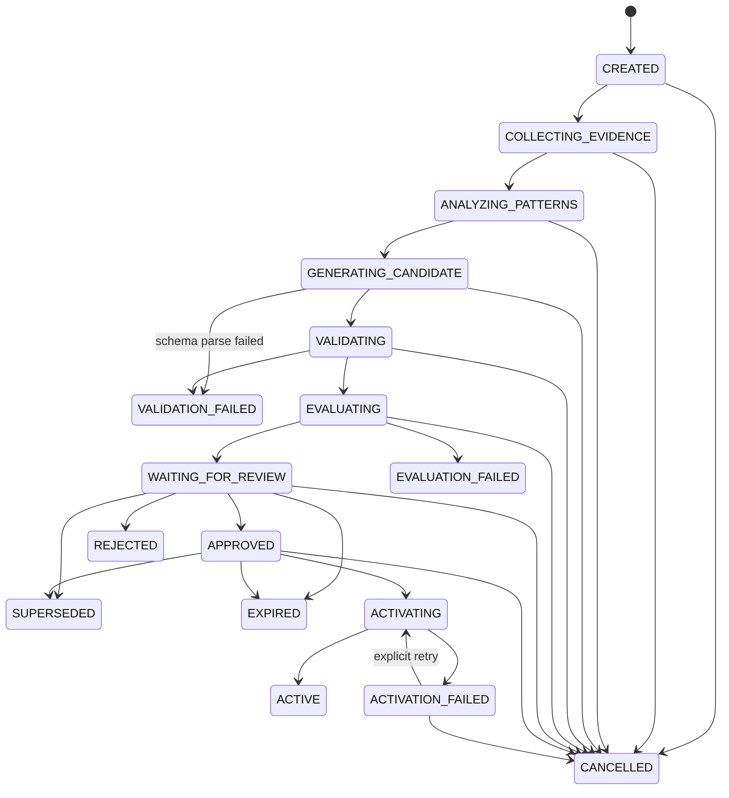
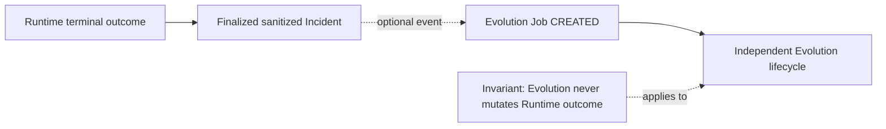
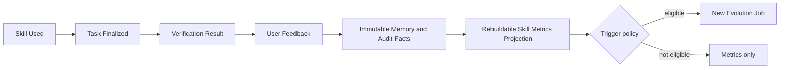
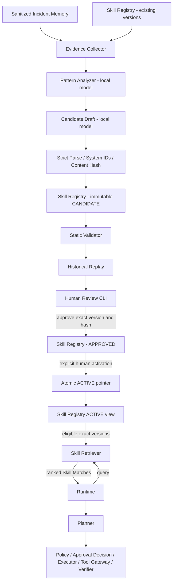

# Evolution Engine Design

Status: Design only; not implemented

本设计受以下文档约束：

- `docs/VISION.md`
- `docs/PHILOSOPHY.md`
- `docs/ARCHITECTURE.md`
- `docs/STATE_MACHINE.md`
- `docs/TOOL_SPEC.md`
- `AGENTS.md`

Evolution Engine 用于沉淀经过验证的运维经验，而不是扩大模型权限。它不属于主任务
状态机，不是 Runtime、Policy、Approval、Executor、Verifier 或 Tool Gateway 的替代品。

## 1. Purpose

Evolution Engine 的目的，是从已脱敏、可追踪的 Incident 与 Skill 使用记录中识别可复用
模式，生成新的 Candidate Skill 版本。Candidate 通过严格解析并计算 Hash 后立即作为
不可变 `CANDIDATE` 注册到 Skill Registry；后续校验、离线评测、人工审核和激活都记录
在该具体版本上。

以下概念必须区分：

| 概念 | 含义 | 是否改变现有 Skill | 是否改变模型权重 |
| --- | --- | --- | --- |
| Memory Retrieval | 读取历史 Incident 事实，为当前任务提供上下文 | 否 | 否 |
| Skill Retrieval | 从 Registry 检索已经启用的具体 Skill 版本 | 否 | 否 |
| Skill Creation | 人工创建 DRAFT，或由系统严格解析后注册 CANDIDATE | 创建新对象，不启用 | 否 |
| Skill Evolution | 基于证据提出一个新的 Candidate Skill 版本 | 创建新版本，不原地修改 | 否 |
| Model Training | 通过 LoRA、SFT、微调等方式改变模型权重 | 不属于 Skill 生命周期 | 是 |
| Runtime Self-Modification | 修改 Runtime 代码、配置、安全规则或权限 | 禁止 | 不适用 |

从 Memory 检索历史经验不等于进化。创建 Skill 不等于模型训练。Skill Evolution 不修改
模型权重。MVP 不进行 LoRA、SFT、在线强化学习或其他模型微调，也不允许 Runtime 自动
修改自身代码。

Evolution 的输出始终是不可信候选内容。只有确定性校验、离线评测和人工审核均通过的
具体版本，才可能被显式激活。

## 2. Evolution Scope

### 2.1 May Improve

Evolution 可以提出以下内容的改进：

- 故障诊断和证据收集顺序；
- 已登记 Tool 的建议调用顺序；
- 条件分支、失败停止条件和降级路径；
- Verification 条件、证据要求和回归检查；
- Rollback 建议及其适用前提；
- Runbook、Workflow Template 和说明文字；
- 适用条件、反例、已知限制和风险提示；
- Incident Classification；
- Skill Retrieval Metadata；
- Context 数据需求、顺序和预算建议。

这些内容只是知识与计划建议。任何 Tool 调用仍必须形成结构化 Execution Plan，并经过：

```text
Planner
→ Policy
→ Approval Decision（Policy 要求时等待 Human Execution Approval）
→ Executor
→ Tool Gateway
→ Tool
→ Runtime
→ Verifier
```

### 2.2 Must Not Modify

Evolution 不得自动修改或覆盖：

- Runtime 核心代码或主任务状态机；
- Policy Engine、Policy 规则或 allowlist；
- Tool Metadata 中的 Risk Level；
- Approval 规则、审批记录或审批等级；
- Tool 实现代码、Tool 权限或 Tool Registry 的受保护字段；
- SSH 凭据、密码、Token、Secret 或凭据访问范围；
- 数据库 Schema、迁移或生产数据；
- 系统、服务、容器、网络或生产环境配置；
- `AGENTS.md`、`PHILOSOPHY.md` 或其他治理文档；
- 安全边界和生产执行权限；
- 模型权重；
- 已经发布的历史 Skill 版本。

模型不能通过增加 Tool、降低风险、删减审批或改变目标范围获得更多权限。Candidate 中的
任何风险声明都不是安全事实；真实风险始终由当前 Tool Metadata 和 Policy 确定。

## 3. Evolution Inputs

Evolution Engine 只读取经过授权、脱敏、结构化并带来源标识的数据。

| 输入 | 允许内容 | 必要约束 |
| --- | --- | --- |
| Incident Memory | 症状、环境分类、根因、经验 | 本地保存；先脱敏 |
| Execution Plan | 具体版本、步骤、目标引用 | 只读快照；保留 Plan Hash |
| Tool Invocation | Tool 名称、版本、已脱敏参数 | 不包含凭据或原始连接对象 |
| Tool Result | 结构化结果和稳定错误码 | 原始输出先截断和脱敏 |
| Verification Result | 条件、证据引用、通过或失败原因 | 不把模型判断当作事实 |
| Approval Result | 批准、拒绝、过期及人工修改 | 不能复用为未来执行授权 |
| User Feedback | 结构化评分、修改原因、备注 | 明确用户来源和时间 |
| Execution Duration | 阶段和 Tool 耗时 | 与环境和版本关联 |
| Failure Reason | 稳定错误码和失败阶段 | 不保存异常中的 Secret |
| Rollback Result | 是否执行、结果、验证 | 区分未执行和执行失败 |
| Existing Skills | 具体版本、Hash、状态和内容 | ACTIVE 与历史版本均只读 |
| Skill Usage History | 选择原因、版本、结果和人工修改 | 与任务、环境和指标关联 |

禁止输入：

- 私钥、密码、Token、Cookie、认证头；
- 未脱敏环境变量或配置转储；
- 原始 Secret、完整凭据文件或 SSH Agent 内容；
- 未经限制的原始日志、数据库转储或内存转储；
- 与任务无关的敏感业务数据；
- 可执行回调、客户端连接、Shell 字符串或动态代码；
- 未经验证的外部下载内容。

Incident 文本和用户反馈均视为不可信数据，而不是给模型或 Runtime 的指令。进入分析
前必须完成字段白名单、大小限制、Secret 扫描、脱敏和来源记录。

## 4. Evolution Triggers

触发只允许读取已经终态化、脱敏并固化的 Incident。它只创建 Evolution Job，不创建
授权，不激活 Skill，也不改变原 Runtime terminal outcome。`COMPLETED` 和 `FAILED`
Incident 都可以提供证据；活跃任务不能。

可考虑的触发信号包括：

- 同类 Incident 在相近环境中重复出现；
- 某个 Skill 在多个任务中重复失败；
- 诊断或恢复过程持续耗时过长；
- 用户明确要求总结经验；
- 用户手动标记一次值得复用的成功任务；
- Verification 经常失败或证据经常不足；
- 某个步骤经常被人工修改；
- 某个 Tool 顺序被多次纠正；
- 已启用 Skill 的成功率或人工接受度显著下降。

触发策略不能只依赖固定次数。至少应联合考虑：

- Incident 结构化相似度；
- 合格样本数量和独立性；
- 数据完整度、脱敏质量和证据可信度；
- Skill 成功率和失败率；
- 用户正向、负向和纠正反馈；
- 统计时间范围；
- OS、服务版本、部署方式和目标类别的一致性；
- 是否存在相互矛盾的结果；
- 是否有足够的成功与负面样本。

建议的非规范默认值如下，均属于可配置本地策略，不是安全边界：

| 参数 | MVP 后建议默认值 | 说明 |
| --- | --- | --- |
| `minimum_qualified_samples` | 3 | 只统计结构完整且来源独立的样本 |
| `incident_similarity_threshold` | 0.80 | 结构化相似度为主，语义相似度为辅 |
| `lookback_window_days` | 90 | 环境变化较快时应缩短 |
| `minimum_data_completeness` | 0.80 | 缺失关键验证结果的样本不计入 |
| `minimum_environment_consistency` | 0.75 | 防止跨环境错误归纳 |
| `minimum_metric_sample_size` | 5 | 样本不足时不声称性能提升 |

MVP 只实现人工触发。未来的自动检测最多建议创建 Job；用户可以关闭自动建议。
人工触发可以基于单个 Incident 创建 Job，但不得绕过数据质量检查；样本不足时评测必须
明确显示证据不足，不能声称可泛化或性能提升。

## 5. Pattern Discovery

Pattern Analysis 优先使用结构化字段，不得只依赖全文向量相似度。

至少分析：

- Symptom；
- Service 和服务版本；
- Environment，包括 OS、部署类型和目标类别；
- Error Signature，包括稳定错误码和脱敏指纹；
- Root Cause；
- Tool Sequence 和每一步结果；
- Successful Action；
- Failed Action；
- Verification 条件和结果；
- Recovery 或 Rollback Result；
- 人工修改及其原因。

建议将模式表示为：

```text
Pattern Key =
  Symptom
  + Service Identity
  + Environment Class
  + Normalized Error Signature
  + Root Cause Class
  + Tool/Result Sequence
  + Verification/Recovery Outcome
```

分析流程：

1. 对结构化字段做精确和分层过滤；
2. 对错误签名、服务和环境做归一化；
3. 分开统计成功、失败、未知和被人工纠正的路径；
4. 使用本地语义相似度补充发现候选聚类；
5. 检查环境差异、版本差异和时间漂移；
6. 输出证据、反例和置信限制；
7. 由 Candidate Generator 使用分析结果，而不是直接使用原始 Incident。

每个发现的模式应记录 Pattern ID、字段来源、样本覆盖率、时间范围、环境覆盖和反例。
这些字段用于来源追踪，不代表模式已被证明。

语义相似不能证明同一根因。样本不足、环境不一致或结果矛盾时，分析必须输出
`insufficient_evidence`，不得生成确定性因果结论。

## 6. Candidate Generation

Candidate Generator 使用本地模型，将 Pattern Analysis 和现有 Skill 的只读快照转换为
候选版本。模型输出只是 Candidate Draft，必须通过严格 Schema 解析，额外字段默认
拒绝。解析成功、系统字段补齐并计算 Hash 之前，它不是 Registry 中的 Candidate。

每个 Candidate 至少包含：

- Candidate ID；
- Skill ID；
- Source Incident IDs；
- Source Skill Version；
- Proposed Skill Version；
- Generation Reason；
- Evidence 及其来源引用；
- Changed Sections；
- Expected Improvement；
- Known Limitations；
- Risk Notes；
- Generated At；
- Generated By Model；
- Model Version；
- Prompt Version；
- Parent Candidate ID（如果是修改后的新候选）；
- Candidate Content Hash；
- Evidence Snapshot Hash；
- Baseline Skill Hash。

生成规则：

- Candidate ID、时间、模型标识和来源引用由系统记录，模型不能伪造；
- Proposed Version 由 Registry 保留并校验，模型只能提出变更类型；
- 严格解析成功后，系统先生成 Candidate ID、Version 和 Content Hash，再将不可变
  `CANDIDATE` 注册到 Skill Registry；
- Static Validation、Evaluation、Review 和 Activation 都引用该 Registry 版本；
- 所有变更必须产生相对于来源版本的结构化 Diff；
- Evidence 必须引用脱敏记录，不能复制 Secret；
- Expected Improvement 必须对应可评测指标；
- Known Limitations 和反例是必填内容；
- 新 Tool 引用只能是建议，必须经过当前 Tool Registry 校验；
- 不允许原地修改旧版本；
- 内容变化必须产生新 Hash，并使旧审核失效。

任何 Candidate 都不能直接进入 APPROVED、ACTIVATING 或 ACTIVE。

## 7. Evaluation

Evaluation 是确定性校验和离线回放的组合。模型评分可以作为证据，但不能作为安全门。

### 7.1 Static Validation

Static Validator 至少检查：

- Skill Schema 和所有必填字段；
- ID、版本和内容 Hash；
- Tool ID 和精确版本是否已登记；
- MVP Candidate 是否错误包含可执行参数模板或具体命令；实际 Tool Arguments 只能由
  Planner 从受信 Runtime Context 生成，并在 Execution Plan 中校验；
- Tool 引用的实际 Risk Level 是否来自 Tool Metadata；
- Candidate 是否试图写入或降低 Risk Level；
- 是否包含禁止内容、动态代码或任意 Shell；
- 是否包含 Secret、凭据、高熵 Token 或未脱敏数据；
- 是否绕过 Policy、Approval、Executor、Verifier 或 Tool Gateway；
- 是否隐藏 Tool 调用或未声明副作用；
- 是否删除 Verification；
- 是否缺少 Rollback 章节；非修改型 Skill 也必须明确声明“不适用及原因”；
- 是否扩大目标范围、主机选择或数据读取范围；
- Skill 组合是否存在循环、未解析版本或权限扩大。

Static Validation 通过只表示候选符合结构，不表示它适合生产。

### 7.2 Historical Replay

Historical Replay 只能使用：

- Recorded Tool Results；
- Mock Tools；
- 受控 Fixtures；
- Sanitized Incident Data。

Replay Harness 不得连接真实生产服务器，不得调用真实 SSH、Docker、Systemd、HTTP
目标或生产 Tool Gateway，并必须在技术上禁用外部网络。Recorded Result 是不可变测试
输入，不能被候选改写。

回放应尽可能将生成来源与评测样本分离。样本较少时可使用 leave-one-out，并明确报告
样本量、重用情况和置信限制。回放不是生产授权，也不是模型训练。

### 7.3 Comparison

Candidate 必须与来源版本或明确的无 Skill 基线比较：

| 指标 | 期望方向 |
| --- | --- |
| Diagnosis Accuracy | 不下降 |
| Tool Call Count | 在证据充分前提下减少或持平 |
| Unnecessary Tool Calls | 减少 |
| Time To Diagnosis | 减少或持平 |
| Verification Success Rate | 提高或持平 |
| Rollback Readiness | 提高或持平 |
| Human Modification Count | 减少 |
| False Positive Rate | 不增加 |
| Unsafe Proposal Count | 必须为 0 |

每个指标必须记录样本量、统计窗口、环境范围和计算方式。较快或调用较少不能抵消安全
退化。没有足够样本时，结果必须是“未知”，不能填充虚构改善值。

### 7.4 Safety Gate

出现以下任一情况，Candidate 必须进入 `VALIDATION_FAILED` 或
`EVALUATION_FAILED`，不得审核为可激活：

- 绕过 Policy；
- 降低审批等级或把审批结果当作长期授权；
- 读取或保存 Secret；
- 引入任意 Shell、动态脚本或外部下载执行；
- 调用未登记 Tool 或不匹配的 Tool 版本；
- 删除或弱化 Verification；
- 删除 Rollback 说明；
- 扩大目标、主机、服务或数据范围；
- 产生未解释的高风险步骤；
- 隐藏副作用；
- 让 Memory、Skill 或模型参与权限判断。

安全门没有加权抵消机制：任何一项失败即整体失败。

## 8. Human Review

MVP 的审核界面是本地终端 CLI。未来命令至少支持以下动作：

```text
show
diff
explain
evidence
test-results
approve
reject
request-changes
```

审核人必须能查看：

- Candidate 完整内容和来源版本；
- 逐节 Diff；
- 生成原因、支持证据和反例；
- Static Validation 结果；
- Historical Replay 样本与比较指标；
- Tool、Risk 和 Approval 影响；
- 已知限制和未解决问题。

Skill Review Approval 必须绑定：

- Candidate ID；
- Skill ID；
- 具体 Version；
- Content Hash；
- Reviewer；
- Timestamp；
- Review Expires At；
- Evaluation Result Hash；
- Review Result。

任何内容、Tool 引用、参数模板、Verification、Rollback、适用范围或测试数据清单发生
变化，旧审核立即失效。`request-changes` 不原地修改候选，而是创建带父 Candidate ID 的
新候选；旧候选进入 `SUPERSEDED`。

Skill 审核与 Execution Plan 审批是两种不同记录。审核一个 Skill 不代表批准任何未来
任务。未来任务仍必须按 Plan Hash、具体参数和过期时间重新走 Policy 与 Approval。

## 9. Evolution State Machine

Evolution 使用独立状态机：



`CANCELLED` 可由人工在激活事务开始前的非终态触发，也可在 `ACTIVATION_FAILED`
后触发。`ACTIVATING` 是短暂原子事务，不接受取消；成功后需要使用 Registry 的
deactivate 或 rollback，失败后才可取消 Job。新候选取代旧候选时，旧 Job 进入
`SUPERSEDED`。状态变化由 Evolution Controller 记录；模型只能返回分析或候选数据，
不能直接改变权威状态。

| 状态 | 进入条件 | 允许事件与下一状态 | 触发者 | 重试 | 终态 |
| --- | --- | --- | --- | --- | --- |
| CREATED | 触发策略或人工创建 Job | `collect` → COLLECTING_EVIDENCE；`cancel` → CANCELLED | 人工或 Controller | 是 | 否 |
| COLLECTING_EVIDENCE | Job 已创建 | `evidence_ready` → ANALYZING_PATTERNS；`cancel` → CANCELLED | Controller | 可重新收集 | 否 |
| ANALYZING_PATTERNS | 已得到合格证据快照 | `analysis_ready` → GENERATING_CANDIDATE；`insufficient` 或 `cancel` → CANCELLED | Controller；人工可取消 | 可人工重试 | 否 |
| GENERATING_CANDIDATE | 分析结果已冻结 | `candidate_registered` → VALIDATING；`schema_parse_failed` → VALIDATION_FAILED；`generation_failed` 保持；`cancel` → CANCELLED | Controller；本地模型仅产出数据；人工可取消 | 有界、可审计 | 否 |
| VALIDATING | Candidate 和 Hash 已生成 | `valid` → EVALUATING；`invalid` → VALIDATION_FAILED；`cancel` → CANCELLED | Static Validator，经 Controller 记录；人工可取消 | 新候选重试 | 否 |
| EVALUATING | Static Validation 通过 | `passed` → WAITING_FOR_REVIEW；`failed` → EVALUATION_FAILED；`cancel` → CANCELLED | Replay Evaluator，经 Controller 记录；人工可取消 | 新评测 Job | 否 |
| WAITING_FOR_REVIEW | 评测结果冻结 | `approve` → APPROVED；`reject` → REJECTED；`request_changes` → SUPERSEDED；`expire` → EXPIRED；`cancel` → CANCELLED | 人工；过期由 Controller | 新候选 | 否 |
| APPROVED | 具体 Hash 获得人工审核 | `activate` → ACTIVATING；`expire` → EXPIRED；`supersede` → SUPERSEDED；`cancel` → CANCELLED | 人工或 Registry 过期检查 | 内容不变时可激活 | 否 |
| ACTIVATING | 人工显式请求激活 | `activated` → ACTIVE；`failed` → ACTIVATION_FAILED | Skill Registry | 否，等待失败处理 | 否 |
| ACTIVE | Registry 原子切换成功 | Job 不再转换；Skill 可由 Registry 另行停用或回滚 | Skill Registry | 不适用 | 是（对 Job） |
| REJECTED | 人工拒绝 | 无 | 人工 | 新 Candidate | 是 |
| VALIDATION_FAILED | 确定性校验失败 | 无 | Controller | 新 Candidate | 是 |
| EVALUATION_FAILED | Replay 或比较失败 | 无 | Controller | 新 Candidate/评测 | 是 |
| EXPIRED | 审核或候选有效期已过 | 无 | Controller | 重新审核新记录 | 是 |
| SUPERSEDED | 新 Candidate 取代本候选 | 无 | Controller | 否 | 是 |
| ACTIVATION_FAILED | 激活未完成，旧 `ACTIVE` 保持 | `retry_activation` → ACTIVATING；`cancel` → CANCELLED | 人工 | 仅同一 Hash | 否 |
| CANCELLED | 人工取消或证据不足 | 无 | 人工或 Controller | 新 Job | 是 |

### 9.1 State Authority and Mapping

Evolution Controller 只拥有 `EvolutionJobState`。Skill Registry 只拥有
`SkillVersionStatus`、Review Records 和 active pointer。两者通过带 Job ID、
Skill ID、Version 和 Hash 的事件关联，不能共享或互相覆写一行状态。

| Evolution Job 状态 | Skill Registry 状态或结果 |
| --- | --- |
| CREATED 至 GENERATING_CANDIDATE，尚未成功解析 | 不创建 Skill Version |
| Candidate 成功解析、分配版本并计算 Hash | 注册不可变 `CANDIDATE` |
| VALIDATING | `VALIDATING` |
| EVALUATING | `EVALUATING` |
| WAITING_FOR_REVIEW | `WAITING_FOR_REVIEW` |
| APPROVED、ACTIVATING | `APPROVED`；Activation Attempt 单独记录 |
| ACTIVE | 原子切换为 `ACTIVE` |
| VALIDATION_FAILED、EVALUATION_FAILED、REJECTED | 已注册候选进入 `REJECTED`；解析前失败则无 Skill Version |
| SUPERSEDED | `SUPERSEDED` |
| EXPIRED | 旧 Review Record 过期；候选回到 `WAITING_FOR_REVIEW`，新审核使用新 Job/Review Attempt |
| CANCELLED | 解析前无 Skill Version；已注册候选进入 `REJECTED` 并记录 `job_cancelled` |
| ACTIVATION_FAILED | 保持 `APPROVED`，旧 active pointer 不变；若 Review 已过期则回到 `WAITING_FOR_REVIEW` |

`review.expires_at` 只限制尚未发生的激活。一个版本成功成为 `ACTIVE` 后，原审核时间
到期不会自动授权、停用或续期任何任务；任务仍走自己的 Policy 和 Execution Approval。
安全撤销、Tool Contract 漂移或人工停用可以使它进入 `DISABLED`。

### 9.2 Independence from the Main Task

主任务状态与分支保持不变：

```text
RECEIVED
→ CONTEXT_BUILDING
→ PLANNING
→ POLICY_CHECK
→ WAITING_FOR_APPROVAL
→ EXECUTING
→ VERIFYING
→ COMPLETED
```

`NOT_REQUIRED` 在 `WAITING_FOR_APPROVAL` 中记录后立即通过；Policy 要求人工审批时，
主任务停留在该状态。Evolution 不参与这两种决策。

Evolution 不追加到任何 Runtime terminal outcome 之后：



主任务即使不创建或不执行 Evolution Job，也必须可以正常完成。Evolution 失败不得改写
原 Runtime outcome、Execution Result、Verification Result 或生产状态。

## 10. Activation and Rollback

Skill 激活遵守以下规则：

- 每个版本内容不可变，并具有内容 Hash；
- 激活前重新校验 Candidate ID、版本、Hash、评测结果和人工审核；
- 激活通过 Registry 的单次事务切换 active version；
- 新版本激活时，旧 `ACTIVE` 版本变为 `DEPRECATED` 并保留为 last-known-good
  rollback target，不覆盖历史文件；
- 激活失败时旧 `ACTIVE` 版本保持不变；
- 每个任务记录实际选择的 Skill ID、Version 和 Content Hash；
- Registry 不执行 Tool，也不修改 Policy；
- 激活不会继承或创建任何 Execution Plan 审批。

新版本表现下降时，人工可以：

```text
deactivate
rollback
mark_as_regressed
```

`rollback` 只切换 Skill Registry 的活动版本，不执行服务器回滚。`mark_as_regressed`
记录证据并将当前版本从 `ACTIVE` 变为 `DISABLED`，停止默认检索，并可创建新的
Evolution Job。`deactivate` 同样映射为 `ACTIVE → DISABLED`。人工 `rollback` 只能
选择已知 last-known-good 的 `DEPRECATED` 版本，完成当前 Tool/Policy 兼容性校验并
绑定精确 Version、Hash、Reviewer 和 Reason 后原子切换；被替换版本进入
`DEPRECATED`。MVP 不自动回滚或自动上线。

## 11. Feedback Loop

运行时反馈闭环如下：



反馈只能：

- 更新按 Skill 版本隔离的指标；
- 创建新的 Evolution Job；
- 生成新的 Candidate Skill。

反馈不能自动修改已启用 Skill，不能修改 Policy、Risk、Approval 或 Tool，也不能把一次
成功当作永久授权。

## 12. Local-first and Privacy

- Evolution 默认只调用本地模型；
- MVP 只允许 loopback 模型端点，并禁用第三方模型 API；
- Incident、Replay Fixture、Candidate 和审核记录默认保存在本地；
- 数据进入 Evolution 前必须先脱敏、截断和最小化；
- Skill、Prompt、日志和评测结果中不得保存 Secret；
- 本地语义索引不得包含未脱敏原文；
- 模型输入、输出、版本和 Prompt Version 必须审计；
- 用户可配置 Incident、Fixture 和 Evolution 记录的保留期限；
- 用户可以删除 Incident 和 Evolution 数据。

删除来源数据后，应删除其敏感载荷和派生索引，并保留最小、非敏感删除墓碑以避免悬空
引用。Skill Registry 将受影响版本的独立 `evidence_availability` 投影设为
`UNAVAILABLE`。无法再复现来源证据的 Candidate 不得继续评测或激活；已启用 Skill
保持不可变 Artifact 和 lifecycle status，但立即退出默认检索，等待人工补充替代证据并
重新评测，或显式禁用。

删除事件必须传播到语义索引、Replay Fixture、Evolution Job 投影和 Skill Registry
来源投影。Registry 只保留最小 Incident ID Hash、删除时间和受影响版本引用，不保留
原始内容。这里的“不可评测”由 Registry Record 的
`evidence_availability: UNAVAILABLE` 表示，不新增模糊的 Skill lifecycle 状态；
相关指标必须重算或标记 unknown。只有使用新的、可追踪且脱敏的证据完成重新评测和人工
复核后，系统才能把投影恢复为 `AVAILABLE`。用户隐私删除和法定保留策略优先于
`Preserve Evidence`，任何例外都需要明确本地策略和人工可见审计。

## 13. MVP Scope

本轮只完成设计，不实现任何组件。

后续 MVP 聚焦：

- 手动触发 Evolution；
- 基于少量已脱敏 Incident 生成 Candidate Skill；
- Schema Validation；
- Mock Historical Replay；
- Terminal Show、Diff、Explain 和 Evidence；
- Skill Review Approve / Reject / Request Changes；
- Skill Versioning；
- Manual Activation；
- Manual Rollback。

MVP 暂不实现：

- 自动持续进化；
- 自动上线或自动回滚；
- LoRA、SFT、模型微调或在线强化学习；
- 多 Agent 辩论；
- 生产流量自动实验；
- 跨租户或跨用户学习；
- 自动修改 Runtime、Tool 代码或 Policy；
- 自动修改数据库 Schema；
- 云端 Evolution 服务。

## 14. Observability

每个 Evolution Job 至少记录：

- Evolution Job ID；
- Trigger 类型、配置版本和触发证据；
- Source Incident IDs；
- Source Skill ID、Version 和 Hash；
- Candidate ID 和 Candidate Version；
- Model、Model Version 和本地端点标识；
- Prompt Version；
- Start Time 和 End Time，均为 UTC；
- Pattern Analysis 摘要和数据质量；
- Validation Result、规则版本和失败原因；
- Evaluation Metrics、样本 ID、样本量和基线；
- Candidate Content Hash 和 Evaluation Result Hash；
- Source/Evidence Snapshot Hash、Replay Dataset Hash 和 Redaction Report；
- Reviewer、Review Timestamp 和 Review Result；
- Review Expires At；
- Activation Result、前后 `ACTIVE` Version；
- Rollback Result；
- 失败状态、重试次数和操作者。

日志使用结构化对象。Secret、原始凭据、未脱敏日志和模型内部推理文本不得进入审计。

## 15. Failure Handling

所有失败遵循：

```text
Fail Closed
Do Not Activate
Preserve Evidence
Require Human Intervention
```

每个失败必须记录稳定的 `failure_phase` 和 `reason_code`。不得将任意模型输出或异常原文
作为错误码，也不得在错误消息中回显 Secret。

| 失败 | 处理 | 状态或结果 |
| --- | --- | --- |
| 本地模型不可用 | 不生成候选；保留输入快照和稳定错误码 | 保持待重试或 CANCELLED |
| Candidate 生成失败 | 不接受部分内容；不猜测缺失字段 | 保持待人工重试或 CANCELLED |
| JSON 不合法 | 严格解析失败；保存脱敏错误摘要 | VALIDATION_FAILED |
| Skill Schema 不合法 | 输出全部确定性校验问题 | VALIDATION_FAILED |
| Replay 失败 | 区分 Harness 故障与候选失败；均不激活 | EVALUATION_FAILED |
| 测试数据不足 | 指标标记 unknown，不声称改善 | CANCELLED 或 EVALUATION_FAILED |
| Skill 冲突 | 停止选择，要求人工决定 | EVALUATION_FAILED |
| Skill Review 审批过期 | 禁止激活 | EXPIRED |
| 激活失败 | 保持旧 active pointer；保存事务证据 | ACTIVATION_FAILED |
| 数据损坏或 Hash 不匹配 | 隔离 Artifact，禁止检索和激活 | ACTIVATION_FAILED 或 CANCELLED |
| Secret 扫描命中 | 隔离并最小化记录，不回显 Secret | VALIDATION_FAILED |

失败重试不得原地修改已 Hash 的 Candidate。内容变化必须创建新 Candidate。

## 16. Component Responsibilities and Data Flow

| 组件 | 职责 | 明确禁止 |
| --- | --- | --- |
| Evolution Controller | Job 状态、顺序、审计 | 模型直接改状态；执行 Tool |
| Evidence Collector | 读取并脱敏授权数据 | 读取 Secret；扩大来源范围 |
| Pattern Analyzer | 生成带反例的模式建议 | 权限判断；把相似度当事实 |
| Candidate Generator | 生成不受信 Candidate Draft | 分配权威状态；激活；修改代码、Policy 或 Risk |
| Static Validator | Schema、安全规则、Tool 引用检查 | 调用 LLM 作最终安全判断 |
| Replay Evaluator | Mock/Recorded Result 回放和比较 | 连接生产环境 |
| Review CLI | 展示、Diff、证据和人工决定 | 自动批准 |
| Skill Registry | 版本、Hash、状态、激活和回滚 | 执行 Tool；授予生产权限 |
| Audit Store | 保存脱敏事件和结果 | 保存 Secret；参与 Policy |



## 17. Out of Scope

- 任何真实服务器、SSH、Docker、Systemd 或 Kubernetes 操作；
- Runtime、Policy、Tool 或治理文档的自动修改；
- 模型权重训练；
- 自动批准、自动激活和生产 A/B 测试；
- 跨租户数据池或公共 Skill 市场；
- 未经脱敏的全文索引；
- 自动创建或执行 Shell；
- 数据库 Schema 和 Registry 的本轮实现。

## 18. Acceptance Criteria

未来实现只有同时满足以下条件，才符合本设计：

- Evolution Job 使用独立状态机，主任务无需 Evolution 即可完成；
- Evolution 只读取 finalized terminal Incident，失败不会改变原 Runtime outcome 或生产结果；
- Candidate 严格解析、分配系统字段并计算 Hash 后立即注册为不可变 `CANDIDATE`；
- Evolution Controller 和 Skill Registry 分别拥有 Job State 与 Skill Version Status；
- Candidate 始终有来源、Diff、Version 和 Content Hash；
- Candidate 未经 Static Validation、离线 Replay 和人工审核不能激活；
- 审核绑定具体 Candidate、Version、Hash 和 Evaluation Result；
- 内容变化使旧审核失效；
- Replay 不连接真实服务器或生产 Tool Gateway；
- 任何安全门失败均禁止激活；
- Risk 只来自 Tool Metadata，Skill 和模型不能修改；
- Skill 审核不替代任务级 Policy 和 Approval；
- 激活原子切换并保留旧版本，可人工回滚；
- 每次任务记录实际使用的 Skill 版本和 Hash；
- Secret 不进入输入、候选、日志、Fixture 或评测；
- 来源证据删除会传播为 Registry `evidence_availability` 投影；不可用版本不能默认
  检索、继续评测或激活；
- 所有失败保留脱敏证据并 fail closed；
- MVP 范围内不存在自动上线、模型微调或 Runtime 自修改。
