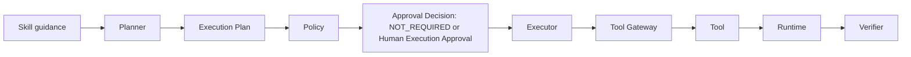
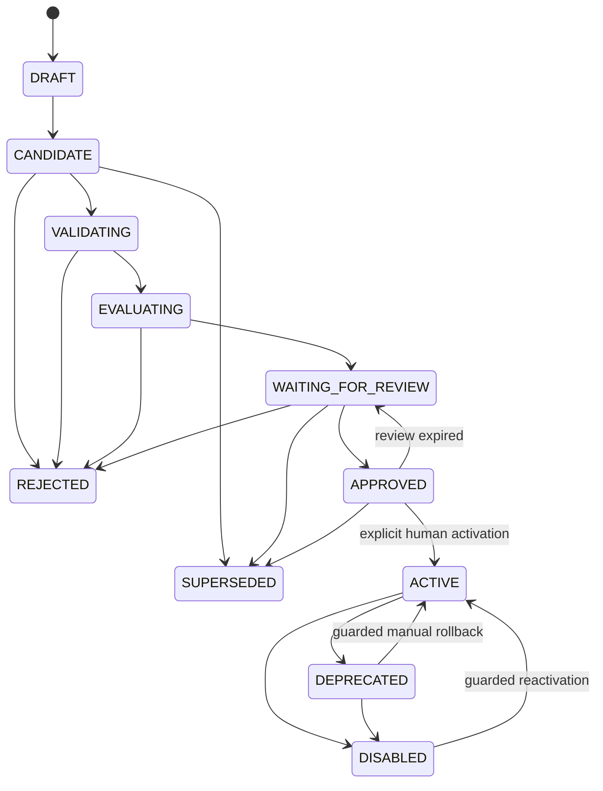
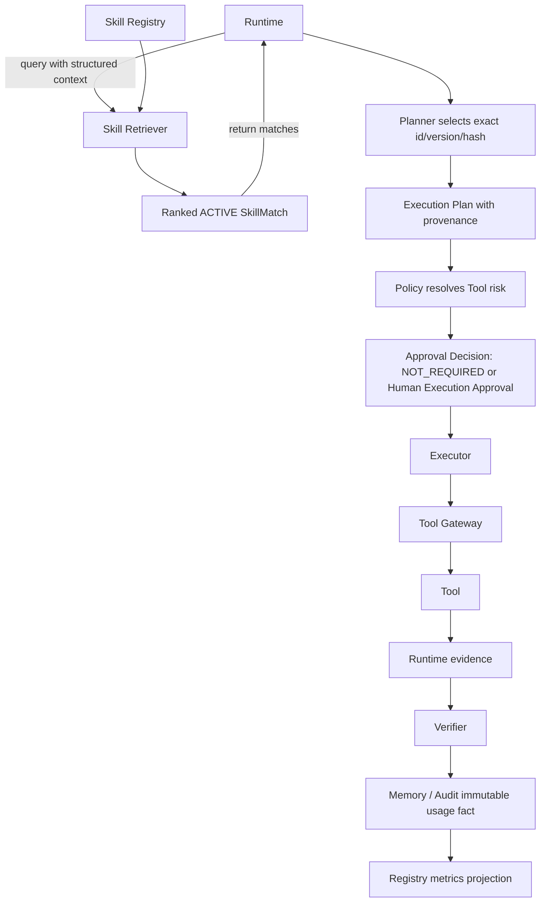

# Skill System Design

Status: Design only; not implemented

本设计受 `docs/VISION.md`、`docs/PHILOSOPHY.md`、`docs/ARCHITECTURE.md`、
`docs/STATE_MACHINE.md`、`docs/TOOL_SPEC.md` 和 `AGENTS.md` 约束，并与
`EVOLUTION.md` 中的 Candidate 生成、评测和审核生命周期配合。

Skill 是知识对象，不是权限对象。Skill 状态、历史成功率、作者或生成模型都不能改变
Policy、Approval、Tool Metadata 或 Runtime 的安全边界。

## 1. Skill Definition

在本项目中，Skill 是：

> 一份经过结构化定义、验证、评测和人工审核的可复用运维知识与执行指导。

Skill 不是：

- 任意 Prompt；
- 聊天记录；
- Shell Script 或命令模板；
- Tool 实现；
- 权限配置或 allowlist；
- Policy；
- Secret、凭据或连接对象；
- 模型权重；
- Execution Plan Approval；
- 可直接运行的代码或插件。

Skill 可以帮助 Runtime 和 Planner 更快地组织证据、诊断、计划与验证，但不能把经验
转化为权限。

## 2. Skill Types

| 类型 | 用途 | 主要消费者 | 输出 |
| --- | --- | --- | --- |
| Diagnostic Skill | 故障诊断、证据收集、根因判断 | Runtime、Planner | 诊断步骤、决策点、证据要求 |
| Runbook Skill | 标准恢复步骤、操作说明、验证、回滚 | Planner | 可转换为 Execution Plan 的指导 |
| Workflow Skill | 多 Tool 受控编排、条件分支、失败停止 | Planner | 声明式步骤和停止条件 |
| Context Skill | 指导收集哪些数据、顺序和预算 | Runtime、Context Builder | 结构化 Context 需求 |
| Verification Skill | 成功条件、健康检查和回归检查 | Planner、Verifier | 验证标准和证据要求 |

Context Skill 不允许 Context Builder 直接调用 Tool。它只能描述所需证据，由 Runtime
使用 Task、受信 Target 配置和脱敏 Memory 构造的最小 `BootstrapContext` 进行结构化
检索。匹配不足时不选择 Context Skill，禁止用模型补全条件。匹配的 Skill 只能建议
预登记 Context Profile 的精确 ID、Version、Content Hash、证据类型和预算。

Runtime 校验 Context Profile Registry 后创建 linked `OBSERVATION` Task。该子任务完整
经过主状态机、Policy、Approval Decision、Executor、Tool Gateway 和 Verifier；父任务
保持 `CONTEXT_BUILDING` 并只消费子任务的终态结构化结果。Observation Task 不能递归
创建 Observation Task。Context Skill 不能提供命令、地址、凭据、自由 Tool 参数或
Profile 内容。

Context Profile 是系统治理 Artifact，不是 Skill 内容。其规范 Schema 至少定义：

- stable Profile ID、immutable Version、Content Hash 和 Registry Status；
- 精确 Tool ID、Version、Contract Hash 以及只读副作用约束；
- 允许从 `BootstrapContext` 和受信 Target Reference 绑定的字段；
- 完整、严格的 Arguments 模板，不允许模型或 Skill 提供自由值；
- Evidence Type、数据量/调用次数/持续时间预算和停止条件；
- Profile Owner、Reviewer、兼容环境和创建时间；
- 固定 `task_role: OBSERVATION` 与 `may_spawn_observation: false`。

Profile 内容变化必须创建新 Version 和 Hash。Context Profile Registry 负责 Schema
校验、不可变版本、状态和精确解析，不执行 Tool。Runtime 只接受硬过滤后唯一匹配的精确
Profile；多个同优先级 Profile 无法确定性消歧时停止并请求人工选择。

Context Profile Content Hash 是对严格通过
`schemas/context-profile-v1.json` 的 Profile 内容计算
`SHA-256(UTF8(RFC8785(profile)))`。输入包含 Profile ID、Version、全部 Tool/Contract
引用、受信参数绑定、预算、停止条件、兼容性和 Owner；排除 `content_hash` 本身以及
Registry Status、Reviewer 和时间戳等可变 Registry 字段。Observation Task 必须重新
计算并绑定该 Hash。

Skill 可以建议调用已登记 Tool，但不能直接执行 Tool。所有真实执行仍经过：



Skill Review 或 ACTIVE 状态不替代任务级 Policy、Approval 和 Verification。

## 3. Skill Anatomy

建议的 Skill Bundle：

```text
skill-directory/
├── SKILL.md
├── metadata.yaml
├── tests/
├── fixtures/
└── references/
```

### 3.1 `SKILL.md`

面向 Agent 和人工审核者的可读指导。它描述适用条件、步骤、证据、分支、验证、回滚和
限制，不包含可执行脚本。

### 3.2 `metadata.yaml`

机器可读元数据，用于 Schema Validation、Registry、检索、兼容性校验和来源追踪。
安全相关字段具有明确所有者，不能相信模型自报。

### 3.3 `tests/`

Skill 的 Schema、静态边界和 Replay 场景。MVP 建议使用由可信 Harness 解释的声明式
YAML/JSON Case，不允许 Bundle 自带任意测试脚本或二进制。

### 3.4 `fixtures/`

脱敏、最小化的 Recorded Tool Results 和 Incident 数据。Fixture 必须标明 Schema
Version、来源、脱敏报告、Hash 和适用环境，不能包含生产凭据。

### 3.5 `references/`

可选的本地补充知识和说明。Reference 不是指令或安全事实，不能动态下载并执行，也不能
包含 Secret。外部知识导入前需要固定版本、来源和内容 Hash。

## 4. Skill Metadata Schema

建议的 `metadata.yaml` 结构：

```yaml
schema_version: "1"
io_schema_dialect: "https://json-schema.org/draft/2020-12/schema"

id: nginx-502-diagnosis
name: Nginx 502 Diagnosis
version: 1.0.0
status: candidate
type: diagnostic
description: Diagnose common Nginx 502 failures.

owners:
  - local-owner

compatibility:
  os:
    - linux
  services:
    - name: nginx
      versions: ["1.24.0", "1.26.0"]

triggers:
  symptoms:
    - http_502
  error_signatures:
    - upstream_timed_out

required_tools:
  - tool_id: get_service_status
    version: 1.0.0
  - tool_id: read_redacted_logs
    version: 1.0.0
  - tool_id: check_port
    version: 1.0.0
  - tool_id: check_http_endpoint
    version: 1.0.0

skill_refs: []

risk:
  maximum_level: L1

approval:
  execution_still_requires_policy: true

inputs:
  type: object
  additionalProperties: false
  properties: {}

outputs:
  type: object
  additionalProperties: false
  properties: {}

verification: []

rollback:
  mode: not_applicable
  reason: Diagnostic Skill does not mutate a managed target.

source:
  incident_ids: []
  parent_skill_version: null

evolution:
  generated_by: null
  generated_at: null
  candidate_id: null

review:
  reviewed_by: null
  reviewed_at: null
  expires_at: null
  content_hash: null
  evaluation_result_hash: null
```

小写 `candidate` 是 YAML 序列化值，对应概念状态 `CANDIDATE`。
该 YAML 是字段骨架；空的 `verification` 不能通过可激活版本的验证。只读 Skill 也必须
定义诊断或证据完成条件，修改型 Skill 还必须提供可执行前提明确的 Rollback 指导。

本节是设计，不是完整的机器 Schema。任何 Skill 可以进入 `ACTIVE` 前，MVP 必须提供并
测试版本化本地规范 Artifact，至少包括：

```text
schemas/skill-metadata-v1.json
schemas/skill-bundle-manifest-v1.json
schemas/skill-replay-case-v1.json
schemas/skill-evaluation-result-v1.json
schemas/skill-registry-record-v1.json
schemas/skill-review-record-v1.json
schemas/skill-activation-attempt-v1.json
schemas/skill-active-pointer-v1.json
schemas/context-profile-v1.json
schemas/context-profile-registry-record-v1.json
```

这些 Schema 必须发布稳定本地 `$id`、使用 JSON Schema Draft 2020-12、拒绝未知字段，
并定义所有嵌套对象、枚举、引用完整性和跨字段验证。Skill Registry Record、Review
Record、Activation Attempt 和 active pointer 四类 Artifact 是 lifecycle 和激活权威，
不得用散列字典或数据库约定替代。Context Profile 两类 Artifact 是 Context Skill
参与远程证据建议的前置。正式 Schema 不存在时，所有示例和 Bundle 最多只能保持
design/candidate 状态，Registry 必须 fail closed；Context Skill 不得触发
Observation Task。

### 4.1 Field Ownership

字段分类：

- **R**：必填；
- **O**：可选或仅在特定生命周期阶段必填；
- **M**：模型可提议，但没有最终权威；
- **H**：人工维护或确认；
- **S**：系统或 Registry 生成；
- **P**：受保护，模型不得修改。

| 字段 | 必填性 | 所有者 | 规则 |
| --- | --- | --- | --- |
| `schema_version` | R | S/P | 只接受受支持版本 |
| `io_schema_dialect` | R | S/P | MVP 固定 JSON Schema Draft 2020-12 |
| `id` | R | S/H/P | 稳定 slug；Registry 保证唯一 |
| `name` | R | M/H | 可提议，需审核 |
| `version` | R | S/P | Registry 分配和校验语义化版本 |
| `status` | R | S/P | 只由 Skill 状态机改变 |
| `type` | R | M/H | 必须是已定义枚举 |
| `description` | R | M/H | 不得包含权限承诺 |
| `owners` | R | H/P | 至少一个本地 Owner；模型不能增删 |
| `compatibility` | R | M/H | 激活前由系统验证 |
| `triggers` | R | M/H | 至少一种结构化触发条件 |
| `required_tools` | R | M/H + S 校验 | 使用 `tool_id`；必须是已登记 Tool 和具体版本 |
| `skill_refs` | R，可为空 | M/H + S 校验 | 固定 Skill ID、Version 和 Hash；禁止循环 |
| `risk.maximum_level` | R | S/H/P | 只收紧的兼容上限，不是实际风险来源 |
| `approval.execution_still_requires_policy` | R | S/P | Schema 常量 `true` |
| `inputs` / `outputs` | R | M/H | 严格 JSON Schema；禁止 Secret 类型和未知字段 |
| `verification` | R | M/H | 必须声明可测试的成功条件 |
| `rollback` | R | M/H | 修改型 Skill 必须完整；只读型用 `not_applicable` 和理由 |
| `source.incident_ids` | R，可为空 | S/P | 人工原创时可为空；Evolution Candidate 必须追踪来源 |
| `source.parent_skill_version` | R，可空 | S/P | 新版本必须记录父版本 |
| `evolution.*` | Evolution Candidate 时 R | S/P | 从实际 Job、模型和时钟生成 |
| `review.*` | APPROVED 后 R | S/H/P | 绑定实际 Reviewer、时间、Hash 和评测 |

`risk.maximum_level` 不是第二个风险权威。它表示该 Skill 允许引用的 Tool 风险上限，
由人工设定并由系统根据 Tool Metadata 校验。实际 Tool 风险高于此上限时，Skill
验证失败；低于上限也不会降低 Tool 的实际风险或审批要求。

`approval.execution_still_requires_policy` 必须为 `true`。Skill 审核和激活不会给未来
Execution Plan 授权。

### 4.2 Registry Overlay and Content Hash

Skill 内容版本不可变，但 `status` 和审核状态天然会变化。因此：

- Bundle 内容、测试和 Fixture 作为不可变 Artifact 保存；
- Registry 是 lifecycle status、review record 和 active pointer 的权威来源；
- Registry Record 还维护系统生成的
  `evidence_availability: AVAILABLE | PARTIAL | UNAVAILABLE` 投影；
- `metadata.yaml` 中的 status/review 是导入快照或导出视图，模型不能写入权威值；
- 对象存储使用不可变 canonical manifest；它不包含可变 status、review record 或
  active pointer；
- Registry 变化不能回写或覆盖对象存储中的 `metadata.yaml` 或 manifest；
- Content Hash 覆盖 `SKILL.md`、安全相关 Metadata、Tests、Fixtures 和 References；
- Hash 排除 Registry 维护的可变状态、审核时间和 Hash 字段本身；
- 审核记录单独绑定 Content Hash 和 Evaluation Result Hash；
- Bundle 内容变化必须生成新 Candidate 和新 Hash。

`evidence_availability` 不属于不可变 Bundle，也不是新的 Skill lifecycle 状态。来源
证据被删除、损坏或无法验证时，Registry 将其设为 `UNAVAILABLE`。该版本立即退出默认
检索；未激活版本不能继续 Evaluation 或 Activation。只有在替代证据完成确定性校验、
Replay 和人工复核后，Registry 才能恢复 `AVAILABLE`。`PARTIAL` 同样不能默认检索，
只能用于人工诊断和补证流程。

Content Hash 使用 SHA-256。Registry 先为每个允许的相对路径计算文件 Hash，再创建包含
Schema Version、路径、文件 Hash 和安全相关 Metadata 的有序 manifest，最后对其 UTF-8
RFC 8785 canonical JSON 计算 Content Hash。符号链接、路径穿越、重复规范化路径和未在
manifest 中声明的文件一律拒绝。

## 5. Skill Content Structure

`SKILL.md` 应使用以下标准章节：

```text
Purpose
Applicability
Preconditions
Symptoms
Required Context
Diagnostic Procedure
Decision Points
Recommended Tools
Expected Evidence
Execution Guidance
Verification
Rollback
Failure Conditions
Safety Notes
Known Limitations
Examples
Anti-patterns
```

每个复杂步骤必须说明：

- **Why**：为什么需要该步骤；
- **What**：声明式动作或证据需求；
- **Expected Evidence**：期望的结构化证据；
- **Failure Meaning**：失败、缺失或矛盾意味着什么；
- **Next Step**：下一步、停止或请求人工。

Skill 不得把“模型认为成功”当作 Verification。Verification 必须引用可获得、可验证的
结构化证据。

## 6. Skill Lifecycle



| 状态 | 含义 | 合法下一状态 | 触发者 | 默认可检索 |
| --- | --- | --- | --- | --- |
| DRAFT | 未注册、可编辑工作副本 | CANDIDATE | 仅人工 | 否 |
| CANDIDATE | 已分配 Candidate ID 和 Hash 的不可变候选 | VALIDATING、REJECTED、SUPERSEDED | Registry / 人工 | 仅评测 |
| VALIDATING | 正在做确定性校验 | EVALUATING、REJECTED | Validator，经 Registry 记录 | 否 |
| EVALUATING | 正在离线 Replay 和比较 | WAITING_FOR_REVIEW、REJECTED | Evaluator，经 Registry 记录 | 否 |
| WAITING_FOR_REVIEW | 内容和评测已冻结 | APPROVED、REJECTED、SUPERSEDED | 人工 | 否 |
| APPROVED | 具体 Hash 已获审核，但未激活 | ACTIVE、WAITING_FOR_REVIEW、SUPERSEDED | 人工显式激活；过期检查 | 否 |
| ACTIVE | 当前允许默认运行时检索 | DEPRECATED、DISABLED | 人工 / Registry | 是 |
| DEPRECATED | 曾经 ACTIVE、被新版本替换且可作为 last-known-good rollback target | ACTIVE、DISABLED | 受守卫的人工 rollback；人工禁用 | 否 |
| DISABLED | 人工、安全或 regression 原因停用 | ACTIVE | 受守卫的人工 reactivation | 否 |
| REJECTED | 具体候选因拒绝、取消或失败 Gate 而不可激活 | 无 | 人工、Controller 或安全 Gate | 否 |
| SUPERSEDED | 激活前被新 Candidate 取代 | 无 | Registry | 否 |

规则：

- `DRAFT` 是未注册 Workspace，不是可检索版本；
- Candidate Generator 不创建 `DRAFT`；严格解析、系统分配 Version 和 Hash 后直接注册
  不可变 `CANDIDATE`；
- 一旦进入 `CANDIDATE`，内容不能原地修改；
- `request-changes` 创建新 Candidate，旧 Candidate 进入 `SUPERSEDED`；
- 禁止 `DRAFT → ACTIVE`、`CANDIDATE → ACTIVE` 或自动 `APPROVED → ACTIVE`；
- 模型不能触发 approve、activate、disable 或 rollback；
- 新版本激活时，旧 `ACTIVE` 进入 `DEPRECATED`，不是 `SUPERSEDED`；
- `deactivate` 和 `mark_as_regressed` 映射为 `ACTIVE → DISABLED`；
- rollback/re-activation 使用单独的、可审计 Activation Attempt。目标版本在尝试期间保持
  `DEPRECATED` 或 `DISABLED`。`DEPRECATED` rollback 必须通过当前 Schema、Tool、
  Policy 兼容性和安全撤销校验，并绑定精确 Version/Hash 的人工 rollback confirmation。
  `DISABLED` reactivation 还必须证明停用原因已经解决，重新完成 Validation、
  Evaluation 和 Skill Review Approval；成功前不得改变状态；
- Review Expiration 只限制尚未发生的激活。`APPROVED → WAITING_FOR_REVIEW` 会创建新
  Review Attempt；对应旧 Evolution Job 保持 `EXPIRED` 终态；
- 已经 `ACTIVE` 后，原 Review 到期不会自动续权或停用，也不影响任务级 Execution
  Approval；
- REJECTED 和 SUPERSEDED 只适用于从未激活的候选，并且对该版本是终态。

## 7. Skill Versioning

使用语义化版本：

```text
MAJOR.MINOR.PATCH
```

- **MAJOR**：改变适用范围、关键流程、目标类别或安全假设；
- **MINOR**：增加行为步骤、分支、Tool 引用或 Verification；
- **PATCH**：修正文案、检索元数据或不影响行为的错误。

Tool 顺序、参数模板、Verification 或 Rollback 的行为变化不能作为 PATCH。

每个版本必须：

- 内容不可变；
- 有 Content Hash；
- 记录父版本和变更原因；
- 记录 Candidate 和来源 Incident；
- 记录测试数据集与 Evaluation Result Hash；
- 记录审核人和审核有效期；
- 可被禁用、取代和人工回滚；
- 在任务开始时固定具体版本和 Hash。

版本范围只能用于作者声明兼容性。MVP 的 Skill 引用和运行时选择只允许精确版本。未来若
支持版本范围，必须在规划前解析并锁定具体版本和全部 Hash。

## 8. Skill Retrieval

Runtime 通过只读 Skill Retriever 查询 Registry。只有 `ACTIVE` Skill 可以默认参与
运行时检索；`CANDIDATE` 只允许在 Validation 和 Replay 环境使用。

`review.expires_at` 是激活截止时间，不是 ACTIVE Skill 的持续执行授权。检索依赖当前
`ACTIVE` 状态、Content Hash、Tool/Policy 兼容性和安全撤销状态；任何生产任务仍需要
独立 Policy 和 Execution Plan Approval。

至少使用以下检索条件：

- Service；
- Symptom；
- Environment；
- Error Signature；
- Skill Type；
- Compatibility；
- Historical Success；
- Skill Status；
- Version；
- Tool Availability；
- Risk Compatibility。

推荐流程：

```text
Structured Hard Filter
+ Keyword Match
+ Local Semantic Similarity
+ Historical Metrics
+ Deterministic Tie-break Rules
```

硬过滤先于排序：

1. `status == ACTIVE`；
2. `evidence_availability == AVAILABLE`；
3. OS、服务、版本和环境兼容；
4. Tool ID、版本和参数 Schema 当前可用；
5. 当前 Tool Metadata 计算的风险不超过受保护兼容上限；
6. 症状和错误签名满足结构化条件。

向量相似度不能单独决定检索结果。Historical Metrics 必须附带样本量、时间窗、环境
范围和数据质量，不能让少量成功或“版本更新”自动胜出。

每个结果必须返回排序理由：

- 命中的结构化字段；
- 未命中或被排除的条件；
- Keyword 和 Semantic 分数；
- 历史指标、样本量和时间范围；
- 风险与 Tool 兼容结果；
- 其他候选及其差异。

## 9. Skill Selection

Planner 可以从已经完成硬过滤的 SkillMatch 中选择具体 ACTIVE Skill，但必须记录：

- Skill ID；
- 精确 Version；
- Content Hash；
- 选择原因；
- 匹配的 Trigger；
- 环境兼容依据；
- 其他候选 Skill；
- 最终置信依据；
- 选择时的 Registry 和 Tool Catalog Snapshot。

Selection 是规划证据，不是权限决定。Skill 不能改变 Risk Level，Planner 不能相信
Skill 中的审批声明。Policy 必须使用当前 Tool Metadata 对最终 Execution Plan 的每个
步骤重新检查。

若没有合格 Skill，Runtime 可以继续无 Skill 的正常规划；若用户明确要求某个不可用
版本，则停止并返回明确错误，不自动选择宽松替代品。

## 10. Skill Execution Boundary

Skill 只提供知识、计划模板和指导，不直接持有：

- SSH Client；
- Docker Client；
- Database Connection；
- Secret 或 Credential；
- Tool Executor；
- Tool Gateway；
- 生产目标连接；
- 可执行回调。

Skill 中禁止：

- 任意 Shell；
- `systemctl`、`docker`、`curl` 等自由命令文本；
- 动态下载脚本并执行；
- 通过模板拼接命令；
- 隐藏 Tool 调用；
- 指示绕过 Policy、Approval 或 Verification。

Tool 建议必须是声明式名称、版本和结构化参数模板。Planner 从受信 Runtime Context
填充参数，Policy 重新验证，Executor 只消费已批准 Plan。Verifier 只评估 Runtime
提供的结构化证据，不执行 Skill 文本。

如果未来允许特定命令模板，必须通过独立 RFC、Tool Schema、Policy 和审批设计；本版本
明确禁止。

MVP Workflow Skill 只能帮助 Planner 在审批前选择并完整展开一个分支。最终 Plan
必须包含有序 Tool Steps、精确版本、具体 Arguments、Verification 和 Rollback，并以
这些内容计算 Plan Hash。执行结果出现后，如果需要未包含的分支、新 Tool 或新参数，
Runtime 必须将当前 attempt 以稳定原因 `plan_expansion_required` 进入 `FAILED`，再创建
linked 新 attempt，从 `RECEIVED` 开始重新 Planning、Policy Check 和适用的 Human
Execution Approval；不存在 `EXECUTING → PLANNING` 回退。Skill 不能动态派发未审批
步骤。

## 11. Skill Composition

MVP 支持显式引用，不支持动态发现或递归执行。

组合规则：

- 引用关系形成有向无环图；
- 禁止直接或间接循环；
- 所有引用都必须声明在 `metadata.yaml.skill_refs`；
- MVP 最大嵌套深度建议为 2，根 Skill 深度为 0；该值属于可配置策略；
- MVP 每个引用必须固定精确 Version；
- 组合快照记录每个子 Skill 的 ID、Version 和 Hash；
- 组合后的 Tool 引用取并集，并按当前 Tool Metadata 重新校验；
- 组合后的实际 Risk 取所有步骤权威风险的最高值；
- 更严格的 Verification、Rollback、目标和数据范围约束优先；
- 子 Skill 不能扩大父 Skill 的目标、权限、凭据或 Tool 范围；
- 子 Skill 的 ACTIVE 状态不替代最终 Plan 审批；
- 版本无法唯一解析或约束冲突时停止并请求人工。

Skill Composition 只是知识组合，不允许 Skill 调用另一个 Skill 作为可执行函数。

## 12. Skill Conflict Resolution

多个 Skill 同时匹配时，按以下顺序处理：

1. 更精确的适用范围和错误签名；
2. 更高的环境和 Tool 版本兼容性；
3. 更严格的目标、数据和安全限制；
4. 有足够样本支持的更高成功率、更低误报率；
5. 人工固定优先级；
6. 更低的人工修改次数；
7. 更新版本仅作为弱 tie-breaker。

成功率不能覆盖安全冲突，更新时间不能覆盖环境不兼容。若两个 Skill 对根因、Tool 顺序、
目标范围、Verification 或 Rollback 给出无法安全合并的指示：

```text
STOP
REQUEST HUMAN SELECTION
```

冲突和人工选择必须进入审计及后续反馈。

## 13. Skill Evaluation

每个 Skill 至少定义：

- Schema Test；
- Tool Reference Test；
- Policy Boundary Test；
- Historical Replay Test；
- Verification Test；
- Negative Case；
- Secret Scanning；
- Unsafe Pattern Scanning；
- Composition Cycle Test（有引用时）；
- Compatibility Test。

测试不连接生产服务器，不使用生产凭据，也不调用真实 SSH、Docker、Systemd 或生产
Tool Gateway；Replay Harness 必须在技术上禁用外部网络。Evaluation 细节遵守
`EVOLUTION.md`：

- 使用 Recorded Tool Results、Mock Tools、Fixtures 和 Sanitized Incident Data；
- 候选与基线使用相同数据集和评分定义；
- Unknown Tool、Risk 漂移、任意 Shell、Secret、Approval 绕过、Verification 删除等
  任一安全失败均拒绝 Candidate；
- 样本不足时报告 unknown，不虚构改善。

Evaluation Result 必须通过 `schemas/skill-evaluation-result-v1.json`，并至少包含
Candidate ID、Skill ID/Version/Content Hash、Evaluator 和 Harness Version、Replay
Dataset Hash、规则版本、各指标及样本量、所有 Safety Gate 结果、开始/结束时间、总体
结果和稳定失败码。`evaluation_result_hash` 为
`SHA-256(UTF8(RFC8785(result_without_evaluation_result_hash)))`；Reviewer、
Review Decision、Activation 和其他后续可变字段不属于 Result，也不进入 Hash。Review
和 Activation 必须独立复算该 Hash。

## 14. Skill Security

Skill 导入、评测和激活前必须扫描并拒绝：

- Secret、私钥、Token、密码和认证头；
- 未脱敏环境变量和原始敏感日志；
- 任意 Shell、自由命令、管道和重定向；
- 动态下载或执行脚本；
- 绕过审批、Policy、Executor、Verifier 或 Tool Gateway；
- 修改 Policy、Risk、Tool 权限或 Runtime；
- 隐藏 Tool 调用或副作用；
- 未声明目标、主机、服务和数据范围；
- 未登记 Tool 或不兼容版本；
- 任意可执行文件、符号链接逃逸或路径穿越；
- 把 Incident 文本中的指令当作系统指令。

扫描采用字段 allowlist、Schema Validation、Secret 规则、高熵检测、路径规范化和禁止
模式。Unsafe Pattern Scanner 必须理解字段和语法上下文，不能仅凭否定性 Safety Notes
中出现的命令名称就接受或拒绝整个 Bundle。扫描结果本身不得回显完整 Secret。模型
安全评分不能替代确定性扫描。

## 15. Skill Registry

Skill Registry 负责：

- 存储和定位不可变 Skill Bundle；
- `(Skill ID, Version)` 唯一性；
- 版本和父版本关系；
- 生命周期状态管理；
- Content Hash 校验；
- 结构化检索和排序证据；
- 审批和 Evaluation 记录；
- 原子激活；
- 禁用、Deprecated、Superseded 和人工回滚；
- 基于 Memory/Audit 不可变事实重建的使用指标投影；
- 维护来源证据可用性投影，并在不可用时阻止默认检索、评测和激活；
- Lifecycle、Review、Activation 和 Rollback 审计；
- 启动时一致性检查。

Skill Registry 不负责：

- 执行 Tool；
- 构造 Execution Plan；
- Policy 或 Risk 决策；
- 颁发任务级 Approval；
- 访问 SSH、Docker 或生产目标；
- 调用模型生成 Candidate。

Memory/Audit 是任务实际使用 Skill ID、Version、Hash 和结果的不可变事实源。Registry
指标只是可重建投影；两者不一致时，Registry 必须停止使用受影响指标进行排序并从事实
源重建，不能反向改写 Memory。

## 16. Skill Storage

未来 MVP 可以使用本地文件系统保存不可变 Bundle，并使用 SQLite 保存 Registry 元数据。
本轮不创建目录、数据库模型或 Schema。

建议逻辑布局：

```text
skills/
├── objects/
│   └── <skill-id>/<version>/
├── staging/
├── active/
├── candidates/
├── deprecated/
└── rejected/
```

`objects/` 保存不可变内容。`active/`、`candidates/`、`deprecated/` 和 `rejected/`
是由 Registry 维护的逻辑视图或小型 Manifest，不通过复制或覆盖 Bundle 表示状态。

一致性策略：

1. 将待导入 Bundle 写入同一文件系统的 staging；
2. 完成 Schema、Secret、Unsafe Pattern、路径和 Tool 引用检查；
3. 生成 canonical manifest 和 Content Hash；
4. 同步文件后使用原子 rename 放入 `objects/`；
5. 在 SQLite 事务中登记 READY Artifact；
6. 激活前确认文件存在、Hash 匹配、审核有效、评测有效且 Tool Catalog 未漂移；
7. 使用 SQLite compare-and-swap 事务切换 active pointer；
8. 事务失败时旧 active pointer 保持不变；
9. 启动时执行文件与数据库 reconciliation；
10. 任何文件缺失、Hash 不匹配或重复版本均隔离并 fail closed。

激活检查还必须要求 `evidence_availability == AVAILABLE`。删除或损坏事件在同一本地
事务中更新来源墓碑和该投影；事务不能完成时，受影响版本按 `UNAVAILABLE` 处理，不能
继续默认检索。

文件层是不可变内容真值；SQLite 是状态、索引和 active pointer 真值。文件存在但没有
READY 记录时视为 orphan；数据库指向缺失或 Hash 不匹配文件时禁止检索和激活，不扫描
目录猜测替代版本。

Rollback 是人工触发的 active pointer 切换。目标必须是已知 last-known-good 的
`DEPRECATED` 版本。切换前验证其 Content Hash、当前 Schema、Tool Contract、Policy
兼容性和安全撤销状态，并记录 from/to、Reviewer、Reason、Timestamp 和 Result。成功
时目标进入 `ACTIVE`，被替换版本进入 `DEPRECATED`；失败时原 active pointer 和状态
都保持不变。`SUPERSEDED` 或 `REJECTED` Candidate 不能作为 rollback target。

## 17. Skill CLI

未来终端命令设计：

```bash
ai-server skill list
ai-server skill show <skill-id>
ai-server skill diff <skill-id> <version-a> <version-b>
ai-server skill validate <path>
ai-server skill test <skill-id>
ai-server skill approve <candidate-id>
ai-server skill reject <candidate-id>
ai-server skill activate <skill-id>@<version>
ai-server skill disable <skill-id>
ai-server skill rollback <skill-id>
ai-server skill history <skill-id>
```

行为约束：

- `show` 默认显示状态、版本、Hash、Tool、Risk 兼容结果和来源；
- `diff` 显示内容、Metadata、Tool、Verification、Rollback 和测试变化；
- `validate` 和 `test` 只使用静态检查、Mock 和 Fixture；
- `approve` 绑定 Candidate、Version、Content Hash、Evaluation Result Hash、Reviewer 和
  审核有效期；
- `activate` 是独立人工动作，激活前重新校验；
- `disable` 和 `rollback` 不执行服务器操作；
- 所有修改命令写入本地审计。

本轮不实现任何命令。

## 18. Example Skill

以下 `nginx-502-diagnosis` 是设计示例，不是已登记或可激活 Skill。示例引用的 Tool 当前
不代表仓库已经实现；只有在未来 Tool Catalog 登记具体版本、Schema、Risk 和脱敏契约
且正式 Skill Schema 已存在后，Candidate 才能进入评测。

### 18.1 Example Metadata

```yaml
schema_version: "1"
io_schema_dialect: "https://json-schema.org/draft/2020-12/schema"
id: nginx-502-diagnosis
name: Nginx 502 Diagnosis
version: 1.0.0
status: candidate
type: diagnostic
description: Diagnose a bounded set of common Nginx 502 conditions.

owners: [local-owner]

compatibility:
  os: [linux]
  services:
    - name: nginx
      versions: ["1.24.0", "1.26.0"]

triggers:
  symptoms: [http_502]
  error_signatures: [upstream_timed_out, connection_refused]

required_tools:
  - {tool_id: get_service_status, version: 1.0.0}
  - {tool_id: read_redacted_logs, version: 1.0.0}
  - {tool_id: check_port, version: 1.0.0}
  - {tool_id: check_http_endpoint, version: 1.0.0}

skill_refs: []

risk:
  maximum_level: L1

approval:
  execution_still_requires_policy: true

inputs:
  type: object
  additionalProperties: false
  required: [target_id, service_id, endpoint_id, bounded_time_window]
  properties:
    target_id: {type: string, minLength: 1, maxLength: 128}
    service_id: {type: string, minLength: 1, maxLength: 128}
    endpoint_id: {type: string, minLength: 1, maxLength: 128}
    bounded_time_window:
      type: object
      additionalProperties: false
      required: [start, end]
      properties:
        start: {type: string, format: date-time}
        end: {type: string, format: date-time}

outputs:
  type: object
  additionalProperties: false
  required: [diagnosis_class, evidence_references, confidence_limitations]
  properties:
    diagnosis_class:
      enum:
        - frontend_service_unavailable
        - upstream_connection_refused
        - upstream_timeout
        - proxy_path_inconsistency
        - INCONCLUSIVE
    evidence_references:
      type: array
      items: {type: string}
    confidence_limitations:
      type: array
      items: {type: string}
    suggested_next_skill:
      type: [string, "null"]

verification:
  - required_evidence_is_present
  - evidence_is_not_contradictory
  - diagnosis_is_bounded_to_known_classes

rollback:
  mode: not_applicable
  reason: This Diagnostic Skill proposes no mutation.

source:
  incident_ids: [incident-example-redacted-001]
  parent_skill_version: null

evolution:
  generated_by: local-model
  generated_at: "2026-07-26T00:00:00Z"
  candidate_id: candidate-example-001

review:
  reviewed_by: null
  reviewed_at: null
  expires_at: null
  content_hash: null
  evaluation_result_hash: null
```

`risk.maximum_level: L1` 只是受保护的兼容上限。实际风险必须从这四个 Tool 的当前
Metadata 计算；任一 Tool 的权威风险高于 L1 时，示例验证失败。

### 18.2 Example `SKILL.md`

#### Purpose

对已确认的 Nginx HTTP 502 症状收集受控证据，并将结果归类为有限的诊断类别。本 Skill
不执行重启、配置修改或恢复操作。

#### Applicability

- 目标由本地 allowlist 中的 `target_id` 标识；
- 服务标识为已登记的 Nginx `service_id`；
- 症状为结构化 `http_502`；
- 错误签名与 `upstream_timed_out` 或 `connection_refused` 相关；
- 不适用于多级代理、未知服务或未登记 Endpoint。

#### Preconditions

- Runtime 已建立脱敏 Context；
- 所有建议 Tool 和具体版本均已登记；
- Policy 允许相应只读证据收集；
- 时间窗口、日志行数、端口和 Endpoint 均来自受信配置，不接受自由字符串。

#### Required Context

- `target_id`、`service_id`、`endpoint_id`；
- 最近一次 502 的 UTC 时间范围；
- 脱敏错误签名；
- 已有 Verification 或健康检查结果。

#### Diagnostic Procedure

1. **Confirm service state**
   - **Why:** 区分 Nginx 本身不可用和上游故障。
   - **What:** 建议 `get_service_status` 读取已登记 `service_id`。
   - **Expected Evidence:** 结构化 `running`、`stopped` 或 `unknown`。
   - **Failure Meaning:** 缺失或陈旧结果不能支持根因判断。
   - **Next Step:** `running` 继续；其他结果停止并建议人工选择恢复 Runbook。

2. **Check the registered upstream port**
   - **Why:** 判断已登记上游是否在预期端口接受连接。
   - **What:** 建议 `check_port`，端口来自 `endpoint_id` 的受信配置。
   - **Expected Evidence:** `reachable`、`refused`、`timeout` 或 `unknown`。
   - **Failure Meaning:** `unknown` 或 Tool 失败时不得猜测。
   - **Next Step:** `refused` 进入 connection-refused 分支；`timeout` 进入 timeout 分支。

3. **Read bounded redacted Nginx evidence**
   - **Why:** 将网络现象与 Nginx 的结构化错误签名关联。
   - **What:** 建议 `read_redacted_logs`，使用固定来源、时间窗口和最大行数。
   - **Expected Evidence:** 脱敏 `error_signature` 和时间戳，不包含原始 Header 或 Token。
   - **Failure Meaning:** 证据不足时结果为 `INCONCLUSIVE`。
   - **Next Step:** 只对已知签名进入对应分支。

4. **Check the registered HTTP endpoint**
   - **Why:** 验证上游在应用层是否可响应。
   - **What:** 建议 `check_http_endpoint` 使用 `endpoint_id`，不接受自由 URL。
   - **Expected Evidence:** 状态类别、延迟和结构化健康结果。
   - **Failure Meaning:** 身份、TLS 或认证问题不归本 Skill 自动处理。
   - **Next Step:** 组合全部证据，输出有限诊断或 `INCONCLUSIVE`。

#### Decision Points

| 条件 | 诊断输出 | 后续 |
| --- | --- | --- |
| Nginx 非 running | `frontend_service_unavailable` | 建议人工选择独立 Runbook；不自动重启 |
| 上游端口 refused 且日志匹配 | `upstream_connection_refused` | 建议上游服务诊断 Skill |
| 上游 timeout 且日志匹配 | `upstream_timeout` | 建议容量或应用诊断 Skill |
| HTTP 健康但 Nginx 仍 502 | `proxy_path_inconsistency` | 请求人工检查受控配置证据 |
| 证据缺失或矛盾 | `INCONCLUSIVE` | 停止并请求更多受控 Context |

#### Recommended Tools

只建议 Metadata 中列出的四个只读 Tool。Skill 不调用 Tool，不提供 Shell 命令，也不添加
任意主机、端口、文件路径或 URL。

#### Execution Guidance

任何恢复建议必须由 Planner 生成新的 Execution Plan，并重新经过 Policy、Approval
Decision、适用的 Human Execution Approval、Executor 和 Verifier。本 Diagnostic
Skill 不授权 Restart、Deploy 或配置修改。

#### Verification

诊断完成必须满足：

- 所需证据均存在且在允许时间窗口内；
- Tool 身份、版本、目标和结果 Schema 有效；
- 证据没有相互矛盾；
- 输出属于已知诊断类别或明确为 `INCONCLUSIVE`；
- 所有证据引用可追踪。

如果后续 Runbook 执行恢复，恢复后的服务和 Endpoint 验证属于那个任务的独立
Verification，不由本 Skill 代替。

#### Rollback

不适用。本 Skill 不执行任何修改，因此没有生产状态需要回滚。

#### Failure Conditions

- Tool 未登记或版本不匹配；
- 证据过期、缺失、损坏或矛盾；
- 目标、端口或 Endpoint 不在 allowlist；
- 日志未完成脱敏；
- 当前情况超出已知诊断类别。

任一条件出现时停止，不猜测根因。

#### Safety Notes

- 不包含 Shell、`systemctl`、`curl` 或自由命令；
- 不读取私钥、密码、Token、Cookie 或未脱敏环境变量；
- 不扩大目标、时间窗口、日志范围或 Endpoint；
- 不改变 Risk、Policy 或 Approval；
- 不隐藏 Tool 调用；
- 不自动执行恢复。

#### Known Limitations

不覆盖多级反向代理、应用内部业务错误、动态服务发现、TLS 证书修复、认证流程或配置
变更。证据不足时只能输出 `INCONCLUSIVE`。

#### Example

当结构化日志为 `upstream_timed_out`、上游端口超时且 HTTP Endpoint 无响应时，可输出
`upstream_timeout`，并引用三项证据。不能仅凭一行日志输出该结论。

#### Anti-patterns

- 看到 502 就建议重启；
- 请求完整原始日志；
- 使用自由 URL、主机或端口；
- 把 Skill ACTIVE 当作执行批准；
- 删除 Verification 或把无证据描述为成功。

## 19. MVP Scope

后续 MVP 聚焦：

- 本地 Skill Registry；
- Skill Schema；
- Skill 版本化和 Content Hash；
- ACTIVE / CANDIDATE 状态；
- 结构化检索；
- Terminal Show / Diff；
- Schema Validation；
- Mock Replay Test；
- Skill Review Approval；
- Manual Activation；
- Manual Rollback。

MVP 暂不实现：

- 在线 Skill 商店；
- 第三方 Skill 自动安装；
- Skill 自动上线；
- 跨用户共享经验；
- 自动修改 Tool 代码或 Policy；
- 动态执行任意脚本；
- 多 Agent 评审；
- 自动模型微调；
- 云端 Registry；
- 生产流量实验。

## 20. Components and Data Flow

| 组件 | 职责 | 禁止 |
| --- | --- | --- |
| Skill Registry | 版本、状态、Hash、激活、回滚、审计 | 执行 Tool；权限判断 |
| Skill Retriever | 只读过滤、排序、理由 | 自动选择权限；返回非 ACTIVE |
| Runtime | 提供受控 Context 和候选列表 | 让 Skill 改状态或安全规则 |
| Planner | 选择具体 Skill 并生成 Plan | 直接执行；相信 Skill 风险 |
| Policy | 根据 Tool Metadata 检查 Plan | 调用 LLM；相信 Skill 授权 |
| Approval Engine | 记录并校验 Policy Decision；需要时校验具体 Human Execution Approval | 复用 Skill Review 作为授权；自行决定权限 |
| Executor | 调用已批准 Tool | 解释或执行 Skill 文本 |
| Verifier | 评估结构化证据 | 让 Skill 宣称成功 |
| Memory | 提供脱敏事实和使用历史 | 权限、激活或执行决策 |



## 21. Failure Handling

| 失败 | 行为 |
| --- | --- |
| Registry 不可用 | 记录错误；允许普通无 Skill 规划，除非用户要求具体 Skill |
| Skill 文件缺失或 Hash 不匹配 | 隔离版本，禁止检索和激活 |
| Metadata Schema 无效 | Candidate 进入 REJECTED；ACTIVE 版本进入 DISABLED 并人工处理 |
| Tool 不存在或版本漂移 | 不选择；要求重新 Validation/Evaluation |
| Risk 超过兼容上限 | 验证失败；不能自动提高上限 |
| 多 Skill 冲突 | STOP 并请求人工选择 |
| Replay 数据不足 | 不声称改善，不批准激活 |
| 来源证据被删除或不可验证 | 将 `evidence_availability` 设为 UNAVAILABLE；阻止默认检索、评测和激活 |
| Secret 扫描命中 | 隔离且不回显 Secret |
| SQLite 与文件不一致 | fail closed；启动 reconciliation；保留旧 active pointer |
| Skill Review 过期 | 禁止尚未发生的 Skill 激活；候选回到 WAITING_FOR_REVIEW |
| Execution Plan Approval 过期 | 禁止生产执行；不得由 Skill Review 替代 |
| 激活失败 | 旧版本保持 ACTIVE |
| Rollback 失败 | active pointer 不猜测；要求人工修复 Registry |
| Local Model 不可用 | 已有 ACTIVE Skill 仍可检索；不生成新 Candidate |

所有失败使用结构化错误、保留脱敏证据，不自动放宽匹配、风险或权限。

## 22. Out of Scope

- 本轮实现 Skill Registry、SQLite Schema、CLI 或文件目录；
- 真实服务器、SSH、Docker、Systemd 或 HTTP 操作；
- 任意 Shell、脚本或动态代码；
- Policy、Risk、Approval 或 Tool 权限修改；
- 自动 Candidate 激活；
- Skill 自动执行；
- 第三方 Skill 下载和市场；
- 跨租户数据或共享 Registry；
- 模型训练；
- Runtime 自修改。

## 23. Acceptance Criteria

未来实现必须满足：

- Skill Bundle 具有明确 Schema、字段所有权、Version 和 Content Hash；
- normative Skill Bundle、Registry、Review、Activation、active pointer、Replay
  和 Context Profile Schema 均已存在并拒绝未知字段；
- Candidate 注册后不可原地修改；
- DRAFT 或 CANDIDATE 不能直接 ACTIVE；
- 只有 `ACTIVE` 且 `evidence_availability == AVAILABLE` 的 Skill 参与默认
  运行时检索；
- Candidate 只能在离线评测环境使用；
- 检索先做结构化硬过滤，且不只依赖向量相似度；
- 排序结果提供可审计理由和指标样本信息；
- Planner 固定并记录具体 Skill Version 和 Hash；
- Policy 始终从精确 Tool Metadata 解析并强制执行风险；
- Skill Review 和 ACTIVE 状态不替代 Execution Plan Approval；
- Skill、Registry 和 Retriever 均不能执行 Tool；
- Composition 无循环，解析具体版本，并重新验证 Tool、Risk 和目标范围；
- 任意 Shell、Secret、未知 Tool、隐藏副作用和安全绕过被确定性拒绝；
- Replay 不连接生产服务器；
- 文件与 SQLite 不一致时 fail closed；
- 激活原子切换并保留旧版本；
- 被替换的旧 `ACTIVE` 进入 `DEPRECATED`，可作为受守卫的人工 rollback target；
- `SUPERSEDED` 和 `REJECTED` Candidate 永远不能用于 rollback；
- 每次任务记录实际使用的 Skill ID、Version 和 Hash；
- 示例 Skill 不包含真实执行、任意 Shell 或 Secret；
- 所有审核、激活、禁用、回滚和失败都有结构化审计。
