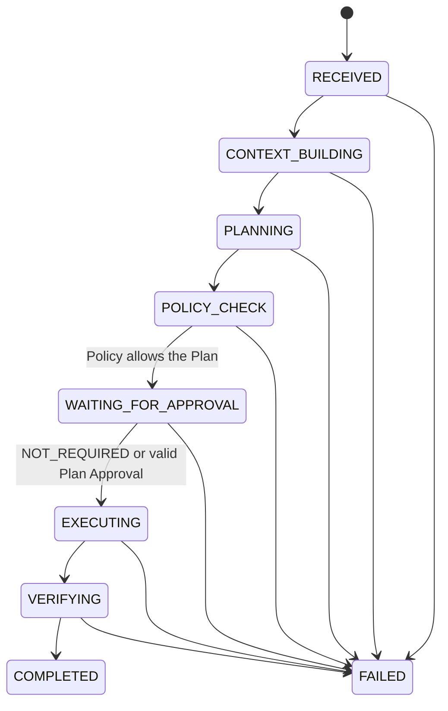
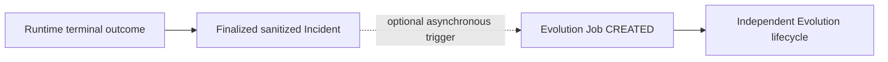

# Runtime State Machine

This document is the canonical source for Runtime state names and transitions.

## Main Runtime Lifecycle



The main lifecycle for every Policy-allowed Plan is:

```text
RECEIVED
→ CONTEXT_BUILDING
→ PLANNING
→ POLICY_CHECK
→ WAITING_FOR_APPROVAL
→ EXECUTING
→ VERIFYING
→ COMPLETED
```

`WAITING_FOR_APPROVAL` is the only canonical approval-decision gate. Every
Policy-allowed Plan enters it. When Policy records `NOT_REQUIRED`, Runtime
records the audited decision and exits the state immediately without waiting
for a human. When Policy requires Human Execution Approval, Runtime remains in
the state until an exact-plan decision is available.

`WAITING_FOR_APPROVAL → EXECUTING` is the governed target transition for the
Approval phase. Until Phase 4 implements and tests Approval Record validation,
approval-paused work must remain non-resumable or enter `FAILED`; Runtime must
not simulate an approval.

## Policy and Approval Authority

Policy is the only component that determines `approval_requirement`. It uses
the exact Execution Plan and authoritative Tool Metadata; it never calls an
LLM.

The Approval Engine does not choose permissions or lower Policy requirements.
For every Policy-allowed Plan, it records or validates one of:

- `NOT_REQUIRED`, produced by deterministic Policy;
- `APPROVED`, produced by an authorized human;
- `REJECTED`, produced by an authorized human;
- `EXPIRED`, produced by deterministic expiration validation.

`Commit` is the human CLI action that creates an Execution Plan Approval. It is
not a third approval object.

- L0 may receive `NOT_REQUIRED` after Policy evaluation.
- L1 is Policy-controlled and may receive `NOT_REQUIRED` or require human
  approval.
- L2 always requires explicit human Approval/Commit.
- L3 requires explicit human Approval/Commit plus an immediate Manual
  Confirmation before the affected Tool invocation.

The current MVP must reject L3 execution until the one-time Manual Confirmation
protocol is implemented and tested.

## Approval Integrity

Execution Plan Approval binds:

- Approval ID;
- exact Plan Hash;
- concrete ordered Steps;
- Tool ID, Version, and Contract Hash for every Step;
- exact target references and Arguments;
- Verification and Rollback requirements;
- Expiration;
- Approver and review timestamp.

The Plan Hash algorithm and canonical serialization are defined by
`ARCHITECTURE.md`. Any bound-content change, Tool Contract drift, Hash mismatch,
or expiration invalidates authorization.

A Skill, model, Memory record, prior approval, or successful execution cannot
reduce these requirements.

## Approval Events

| Current state | Event | Result |
| --- | --- | --- |
| `POLICY_CHECK` | Policy allows with `NOT_REQUIRED` | Enter `WAITING_FOR_APPROVAL` with the audited decision |
| `POLICY_CHECK` | Policy allows and requires human approval | Enter `WAITING_FOR_APPROVAL` and pause |
| `POLICY_CHECK` | Policy denies | Enter `FAILED` with a structured reason |
| `WAITING_FOR_APPROVAL` | Valid `NOT_REQUIRED` decision | Enter `EXECUTING` immediately; no human action |
| `WAITING_FOR_APPROVAL` | Valid L2 approval | Enter `EXECUTING` |
| `WAITING_FOR_APPROVAL` | Valid L3 Execution Plan Approval | Enter `EXECUTING`; each L3 invocation remains blocked by its own immediate confirmation gate |
| `WAITING_FOR_APPROVAL` | Approval rejected | Enter `FAILED` with `human_rejected` |
| `WAITING_FOR_APPROVAL` | Approval expires | Remain paused; the expired record cannot be reused |
| `WAITING_FOR_APPROVAL` | Human requests changes | End the current attempt as `FAILED`; create a linked new attempt with a new Plan Hash |
| `WAITING_FOR_APPROVAL` | Approved snapshot or Hash is altered | Enter `FAILED`; never silently recalculate and continue |

For a future plan containing multiple L3 Steps, every L3 invocation requires a
single-use confirmation bound to the same Approval ID, Plan Hash, Step,
Arguments, and short expiration. Confirmation is an execution gate event, not a
new source of permission and not a Runtime state transition. The current MVP
denies L3 before execution because this per-invocation gate is not implemented.

## Context Collection Boundary

`CONTEXT_BUILDING` only assembles Task data, trusted local configuration,
sanitized Memory facts, and structured evidence already supplied to Runtime.
It never hides Policy or Tool execution inside the state.

If a future phase needs remote evidence, Runtime creates a linked
`OBSERVATION` Task. That child Task follows this same complete lifecycle,
including `POLICY_CHECK`, `WAITING_FOR_APPROVAL`, `EXECUTING`, and
`VERIFYING`. The parent remains in `CONTEXT_BUILDING` and consumes only the
child's finalized structured result. An `OBSERVATION` Task cannot create
another Observation Task, preventing recursive context collection. No nested
or implicit `CONTEXT_BUILDING → EXECUTING` transition exists.

## Failure, Terminal, and Reserved States

Any active Runtime state may fail closed to `FAILED`. `COMPLETED` and `FAILED`
are the only terminal states in the current Runtime.

The enum names below are reserved for later phases and have no legal incoming
or outgoing transitions in the MVP:

```text
PARTIAL_SUCCESS
ROLLBACK
MANUAL_INTERVENTION_REQUIRED
```

They must raise an explicit reserved-state error if used before their owning
phase defines them. Rollback is never an implicit transition: it requires a
separate Execution Plan, Policy check, applicable approval, Executor call, and
Verification.

## Evolution Is Not a Runtime State

Evolution is optional post-task work. After a terminal Runtime outcome is
finalized into a sanitized, immutable Incident record, the system may create an
asynchronous Evolution Job. A successful `COMPLETED` outcome and a failed
`FAILED` outcome can both provide evidence.



This is an event and data relationship, not a Runtime state transition. The
Runtime task must terminate without Evolution, and Evolution cannot change its
terminal outcome.
