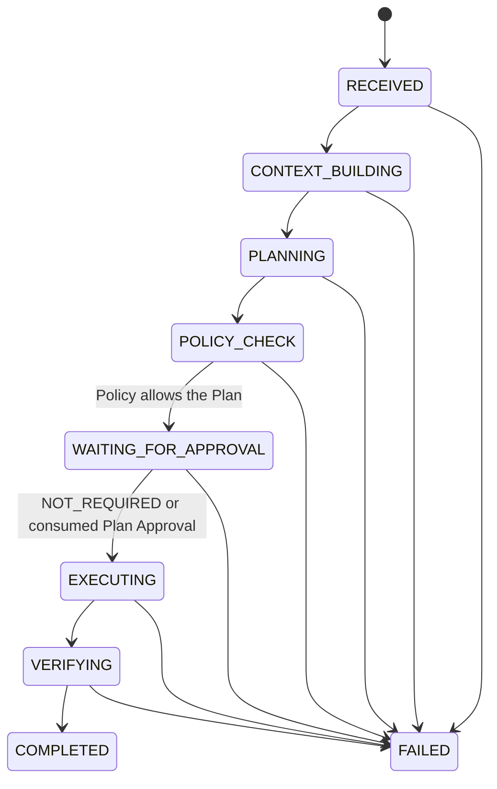
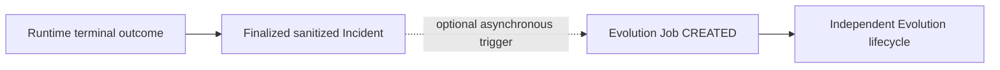

# Runtime State Machine

This document is the canonical source for Runtime state names and transitions.

## Main Runtime Lifecycle



The main lifecycle for every Policy-allowed Plan is:

```text
RECEIVED
→ CONTEXT_BUILDING
→ PLANNING
→ POLICY_CHECK
→ WAITING_FOR_APPROVAL
→ EXECUTING
→ VERIFYING
→ COMPLETED
```

`WAITING_FOR_APPROVAL` is the only canonical approval-decision gate. Every
Policy-allowed Plan enters it. When Policy records `NOT_REQUIRED`, Runtime
records the audited decision and exits the state immediately without waiting
for a human. When Policy requires Human Execution Approval, Runtime remains in
the state until an exact-plan decision is available.

`WAITING_FOR_APPROVAL → EXECUTING` is the governed target transition. Phase 4
could issue and validate an in-process Approval Record but deliberately left
the Task paused. Phase 5 makes the transition reachable for
human-approval-required work only after Executor revalidates and consumes the
exact authorization. Runtime must not simulate an approval.

Consumption has a deliberately local meaning. Plan Approval consumption is
linearized when Executor creates the exact attempt; Runtime may enter
`EXECUTING` only afterward, and a crash before dispatch still burns that
Approval. Per-invocation L3 Confirmation consumption is linearized immediately
before Executor dispatches the already-bound ToolCall in the same call stack.
Neither boundary is a transaction with a remote side effect or guarantees that
a remote operation and local state change commit together.

## Policy and Approval Authority

Policy is the only component that determines `approval_requirement`. It uses
the exact Execution Plan and authoritative Tool Metadata; it never calls an
LLM.

The Approval Engine does not choose permissions or lower Policy requirements.
Runtime records the Policy-produced `NOT_REQUIRED` lifecycle fact. Approval
Engine owns only human Review, Plan Approval, Confirmation, and consumption
ledger facts. Together they expose one of:

- `NOT_REQUIRED`, produced by deterministic Policy and recorded by Runtime;
- `APPROVED`, produced by an authorized human;
- `REJECTED`, produced by an authorized human;
- `EXPIRED`, produced by deterministic expiration validation.

`Commit` is the human CLI action that creates an Execution Plan Approval. It is
not a third approval object.

- L0 may receive `NOT_REQUIRED` after Policy evaluation.
- L1 is Policy-controlled and may receive `NOT_REQUIRED` or require human
  approval.
- L2 always requires explicit human Approval/Commit.
- L3 requires explicit human Approval/Commit plus an immediate Manual
  Confirmation before the affected Tool invocation.

Phase 4 implemented and tested the one-time Manual Confirmation protocol in
isolation and therefore denied production L3 execution. Phase 5 connects
confirmation consumption to the exact Tool dispatch boundary. This removes the
temporary framework-level denial only when the complete Phase 5 boundary is
valid; the default Registry remains L0-only and contains no L3 capability.

## Approval Integrity

Execution Plan Approval binds:

- Approval ID;
- exact Plan Hash;
- concrete ordered Steps;
- Tool ID, Version, Contract Hash, and Implementation Hash for every Step;
- exact target references and Arguments;
- ordered Plan-level `verification_criteria`, including each mandatory
  criterion's kind, evaluator version, evidence Step, expected values, and
  maximum age;
- Verification and Rollback requirements;
- Expiration;
- Approver and review timestamp.

The Plan Hash algorithm and canonical serialization are defined by
`ARCHITECTURE.md`. Phase 6 uses ExecutionPlan v2 and Approval Snapshot v2; a v1
snapshot cannot authorize a v2 Plan. Any criterion or other bound-content
change, Tool Contract drift, Hash mismatch, or expiration invalidates
authorization.

A Skill, model, Memory record, prior approval, or successful execution cannot
reduce these requirements.

## Approval Events

| Current state | Event | Result |
| --- | --- | --- |
| `POLICY_CHECK` | Policy allows with `NOT_REQUIRED` | Enter `WAITING_FOR_APPROVAL` with the audited decision |
| `POLICY_CHECK` | Policy allows and requires human approval | Enter `WAITING_FOR_APPROVAL` and pause |
| `POLICY_CHECK` | Policy denies | Enter `FAILED` with a structured reason |
| `WAITING_FOR_APPROVAL` | Valid `NOT_REQUIRED` decision | Enter `EXECUTING` immediately; no human action |
| `WAITING_FOR_APPROVAL` | Valid L2 approval is revalidated and consumed by Executor | Enter `EXECUTING`; the consumed Approval is bound to this attempt |
| `WAITING_FOR_APPROVAL` | Valid L3 Execution Plan Approval is revalidated and consumed by Executor | Enter `EXECUTING`; every affected invocation still requires its own immediate Confirmation |
| `WAITING_FOR_APPROVAL` | Approval rejected | Enter `FAILED` with `human_rejected` |
| `WAITING_FOR_APPROVAL` | Approval expires | Remain paused; the expired record cannot be reused |
| `WAITING_FOR_APPROVAL` | Human requests changes during Phase 4 | End the current attempt as `FAILED`; linked replanning is deferred to its owning later phase |
| `WAITING_FOR_APPROVAL` | Approved snapshot or Hash is altered | Enter `FAILED`; never silently recalculate and continue |

For a plan containing multiple L3 Steps, every L3 invocation requires a
single-use confirmation whose Challenge Hash covers the complete strict
`ManualConfirmationChallenge` except its self-referential Hash: Schema Version,
Authorization Hash, Approval ID, Approval Plan Hash, Approval Record Hash,
Approval Expiration, Execution Attempt ID, Invocation ID, Step Index/ID/Role,
Tool ID/Version, Contract Hash, Implementation Hash, Arguments Hash, and Target.
The issued Confirmation Record separately binds its short expiration. The CLI accepts only exact
`CONFIRM <challenge-hash>`. Confirmation is an execution gate event, not a new
source of permission and not a Runtime state transition. Executor consumes it
immediately before dispatching the already-bound ToolCall. The bundled CLI is
the only supported Phase 5 production adapter and requires interactive input
and output TTYs. Runtime/Executor reader injection is a trusted process-local
test seam, not proof of human provenance, and must not be connected to a model,
Skill, Tool, pipe, or environment value. The default Registry has no L3 Tool;
production L3 remains unavailable until an independently reviewed design binds
Confirmation to a verifiable interactive source.

## Execution Segments and Invocation Preconditions

An ExecutionPlan contains an `OBSERVE`/`ACTION` prefix followed by a `VERIFY`
suffix. Once a `VERIFY` Step appears, a later `OBSERVE` or `ACTION` Step is
invalid. An L3 Tool is valid only as an `ACTION` Step; L3 `OBSERVE` and
`VERIFY` fail structural validation before dispatch. Every Plan has one or
more ordered, structured, `mandatory=true` Plan-level criteria even when the
`VERIFY` suffix is empty.

A `VERIFY` Step exists only when the immutable Contract of an executed Tool
declares that exact read-only, non-L3 verification Tool, and at least one
criterion must reference it. Every required verification reference declared by
each executed source Tool must have a matching `VERIFY` Step and criterion; a
Plan cannot cover only a subset. A read-only Tool whose Contract permits its
own structured result as evidence does not receive a duplicate verification
call; current `get_system_status@1.0.0` follows this rule. Any mutating Tool
requires independent read-only `VERIFY` evidence. The mutating Action result
alone cannot confirm its effect.

Every `mutates_remote_state=true` source Step must use the `ACTION` role; a
mutation cannot be presented as `OBSERVE`. Phase 6 permits at most one mutating
source Step in a Plan. Every required
verification reference for that Step must be covered by a meaningful
postcondition criterion: `numeric_bounds`, `expected_state`, or
`health_status`. A provenance-only `equals` criterion cannot close a mutation.
Supporting multiple mutating source Steps requires a separately reviewed,
explicit action-to-criterion/effect binding before the limit can be removed.

- Runtime asks Executor to run the prefix only while in `EXECUTING`.
- Successful completion of the prefix yields the next-state fact
  `VERIFYING`; Executor never yields `COMPLETED`.
- Runtime asks Executor to run the suffix only while in `VERIFYING`, then gives
  the resulting evidence to Verifier.

Before each dispatch, every precondition applicable to that current invocation
must pass: immutable Plan binding, current Policy decision, applicable Plan
Approval, exact Registry identity and integrity, Arguments, Target, and any
L3 Confirmation for that Step. A short-lived Confirmation for a later L3 Step
is not obtained as a precondition for an earlier invocation.

## Execution Failure Facts

Only Runtime changes state. It accepts a sanitized, fully revalidated
ExecutionReport for concrete Step facts. If no trustworthy final report exists
and attempt closure cannot be confirmed, Runtime instead records a bounded
ExecutionUncertainty and fails closed; it never invents a report.

| Execution fact | Runtime result |
| --- | --- |
| Failure is known to precede handler entry | `FAILED`; dispatch certainty is `NOT_DISPATCHED`, effect certainty is `NONE` |
| Read-only handler was entered and the invocation failed | `FAILED`; dispatch certainty is `HANDLER_DISPATCHED`, remote effect remains `NONE` |
| Mutating handler was entered and independent Verification is pending | Continue only to `VERIFYING`; dispatch certainty is `HANDLER_DISPATCHED`, effect is `PENDING_VERIFICATION` |
| Mutating handler was entered and outcome or Verification is uncertain | `FAILED`; dispatch certainty is `HANDLER_DISPATCHED`, effect is `UNKNOWN` and human intervention is required |
| No trustworthy Gateway receipt is available | `FAILED`; dispatch and effect certainty are both `UNKNOWN`, and human intervention is required |
| Attempt exists, no dispatch-capable Executor boundary was called, and abort closure cannot be confirmed | `FAILED` with `execution_abort_uncertain`; attempt-level certainty is `NOT_DISPATCHED` / `NONE` |
| A dispatch-capable Executor boundary was called but no trustworthy final closure report exists | `FAILED` with `execution_abort_uncertain`; attempt-level certainty is `UNKNOWN` / `UNKNOWN`, and human intervention is required |

The internal Gateway dispatch receipt is evidence for these facts only. It
does not change Tool Protocol v1 or ToolResult v1. A handler-entry receipt does
not prove that a remote side effect occurred or succeeded. `UNKNOWN` is an
Executor fallback when no trustworthy receipt exists; it is not a receipt
value.

`ExecutionUncertainty` binds the exact Execution Attempt Authorization and may
bind the Hash of the last trusted
`AWAITING_VERIFICATION_DISPATCH` report. When that prior report exists, Runtime
preserves only its already validated results. Every later verification or abort
report must retain that report's exact records and events as an unchanged
cumulative prefix and add closure progress; truncation, rewrite, or replay is
rejected. The uncertainty object contains no fabricated Step ID, Invocation ID,
ToolResult, or completion event. It emits a
separate `execution_uncertainty_audit`; concrete per-Step audit fields remain
available only from a trusted ExecutionReport. This is an exceptional failure
contract, not a new Runtime state and not permission to redispatch.

## Verification Closure

Entry into `VERIFYING` means only that the governed action prefix closed with a
trusted `AWAITING_VERIFICATION_DISPATCH` report. It never means the objective or
a mutating effect has been verified.

Runtime executes any Contract-required `VERIFY` suffix and revalidates the
cumulative report. It then takes one trusted local UTC clock sample and uses
that same sample for both `evidence_accepted_at` and `evaluated_at`; there is no
second evaluation-time read. Runtime computes:

```text
collection_duration_ms = min(
    max(
        ExecutionReport.total_duration_ms,
        ceil_ms(evidence_accepted_at - Runtime EXECUTING entered_at)
    ),
    3_600_000
)
```

The strict `VerificationContext` binds that timing evidence with Task, Plan
digest, Execution Attempt, cumulative report Hash, and whether a mutating
effect is pending. Freshness is evaluated conservatively for every criterion:

```text
conservative_age_ms =
    evaluated_at - evidence_accepted_at + collection_duration_ms
```

The acceptance time is Runtime-owned local receipt evidence, not a remote event
timestamp. Invalid clock order or duration fails closed. A criterion passes
freshness only when this conservative age is no greater than its hashed
`maximum_age_ms`.

Verifier evaluates exactly one ordered check for every mandatory criterion,
using only the four evaluator-version `"1"` kinds `equals`, `numeric_bounds`,
`expected_state`, and `health_status`. It returns a hash-bound
`VerificationResult`; it never changes Runtime state.

| Verification fact | Runtime transition and effect closure |
| --- | --- |
| Valid `PASSED`; every mandatory check passed; no mutating effect pending | `VERIFYING → COMPLETED`; effect is `NONE` |
| Valid `PASSED`; every mandatory check passed; mutating effect pending | `VERIFYING → COMPLETED`; effect becomes `VERIFIED` |
| `FAILED`, inconclusive, malformed, stale, contradictory, or identity-invalid evidence; no mutating effect pending | `VERIFYING → FAILED`; effect remains `NONE` |
| Any non-pass outcome while a mutating effect is pending | `VERIFYING → FAILED`; effect becomes `UNKNOWN` and human intervention is required |
| Verifier throws or cannot complete evaluation (`VERIFIER_FAILED`) | `VERIFYING → FAILED` under the same conservative effect rule |
| Verifier returns an invalid type, structure, binding, order, Hash, closure, or a result unequal to Runtime recomputation (`VERIFIER_RESULT_INVALID`) | `VERIFYING → FAILED` under the same conservative effect rule |
| Contract-required verification evidence cannot be acquired before Verifier runs | `VERIFYING → FAILED`; no VerificationResult is fabricated, and the same conservative effect rule applies |

`COMPLETED` is therefore reachable only from a fully validated `PASSED` result.
Runtime gives an injected Verifier only strictly rebuilt, isolated copies of
the Plan, results, and context. It strictly rebuilds the returned result and
independently recomputes it from Runtime's private trusted inputs with the pure
evaluators; content Hash alone cannot authenticate a conclusion. Duplicate
Invocation IDs, a well-formed forged pass, or any identity/check/evidence
mismatch fails. The terminal RuntimeOutcome binds the accepted result and
Hash, each check's criterion/evidence-Step/evaluator identity, and every
ordered report result through its evidence reference and result Hash.

Every produced VerificationResult emits a structured `verification_audit`
containing only IDs, hashes, status, stable reasons, effect/human closure,
check metadata, and evidence-reference Step/Invocation/result hashes. It never
contains raw evidence, raw observed values, or unredacted arguments.

Verifier cannot retry, request/initiate/execute recovery, or dispatch more
evidence collection. It may only report that a human should consider recovery;
any recovery remains a new governed Task and Plan.

## Context Collection Boundary

`CONTEXT_BUILDING` only assembles Task data, trusted local configuration,
sanitized Memory facts, and structured evidence already supplied to Runtime.
It never hides Policy or Tool execution inside the state.

If a future phase needs remote evidence, Runtime creates a linked
`OBSERVATION` Task. That child Task follows this same complete lifecycle,
including `POLICY_CHECK`, `WAITING_FOR_APPROVAL`, `EXECUTING`, and
`VERIFYING`. The parent remains in `CONTEXT_BUILDING` and consumes only the
child's finalized structured result. An `OBSERVATION` Task cannot create
another Observation Task, preventing recursive context collection. No nested
or implicit `CONTEXT_BUILDING → EXECUTING` transition exists.

## Failure, Terminal, and Reserved States

Any active Runtime state may fail closed to `FAILED`. `COMPLETED` and `FAILED`
are the only terminal states in the current Runtime.

The enum names below are reserved for later phases and have no legal incoming
or outgoing transitions in the MVP:

```text
PARTIAL_SUCCESS
ROLLBACK
MANUAL_INTERVENTION_REQUIRED
```

They must raise an explicit reserved-state error if used before their owning
phase defines them. Rollback is never an implicit transition: it requires a
separate Execution Plan, Policy check, applicable approval, Executor call, and
Verification.

## Evolution Is Not a Runtime State

Evolution is optional post-task work. After a terminal Runtime outcome is
finalized into a sanitized, immutable Incident record, the system may create an
asynchronous Evolution Job. A successful `COMPLETED` outcome and a failed
`FAILED` outcome can both provide evidence.



This is an event and data relationship, not a Runtime state transition. The
Runtime task must terminate without Evolution, and Evolution cannot change its
terminal outcome.
